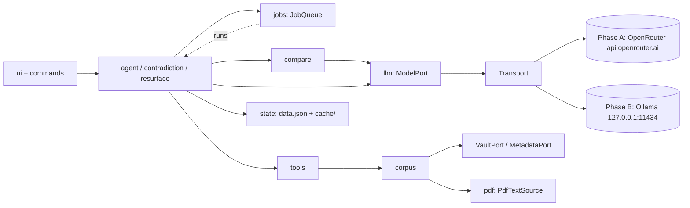
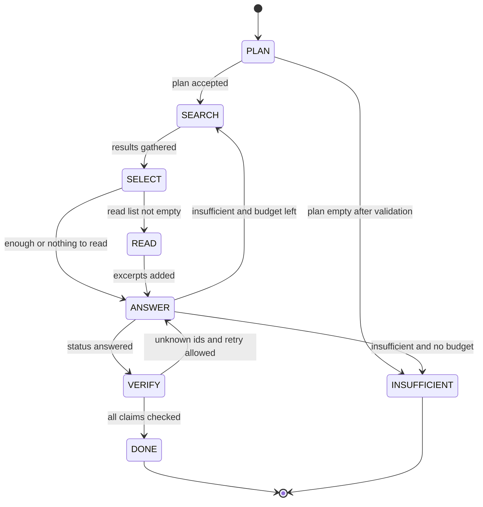

# DESIGN.md: Synapse (working name)

Status: draft v1.1 · Date: 2026-10-05 · Inputs: `SPEC.md` (draft v1.1), `research.md` (Phase 0)
Scope: design only for unfinished modules. Scaffold may exist.

**How to read this document.** §1–3 give the shape of the system. §4–5 are the contracts (data, interfaces, errors). §6 walks the runtime flows. §7 is the repo layout. §8 covers trust/auth, errors, logging and config. §9 is the build and test plan for independent work. §10 holds the ADRs. §11 lists what is out of scope. **§12 is the register of ambiguous or infeasible items in SPEC.md.** §13 maps the open on-device gates to the switches this design provides for them.

**Evidence tags** (carried over from `research.md`): **[V]** verified by running something · **[S]** read from a primary source · **[B]** community source · **[D]** derived from stated assumptions · **[U]** unverified. Two tags are new here: **[design]** is a decision made in this document without external evidence, and **(provisional)** marks a number that must be confirmed by Gate A (the **Phase B** on-device bake-off, §13) before it is committed for local models.

**Naming.** "Synapse" is a working name only. The manifest ID `synapse` is already taken [V, research R7]. The ID, display name, view-type IDs and the user-facing exclusion frontmatter key all derive from one file (`src/constants.ts`), so the rename is a one-file change plus `manifest.json`. See F-07.

**Provider phasing (SPEC §0).** Phase A builds and ships features against **OpenRouter free models**. Phase B (local Ollama + Gate A) starts **only after** Must+Should feature-complete. Do not stall the plan on local VRAM or Ollama ops.

---

## 1. Summary

Synapse is a desktop-only Obsidian plugin. An LLM answers questions about the vault, flags possible contradictions, and resurfaces old notes. It finds evidence with bounded keyword, title, link, tag and frontmatter tools, and every output cites an exact passage.

**Phase A default provider:** OpenRouter Chat Completions with free models (`:free` / `openrouter/free`). Selected excerpts leave the machine — disclosed in UI/README. **Phase B provider:** user-installed Ollama on loopback; Gate A then picks recommended local models.

The design is **ports-and-adapters with a pure TypeScript core.** Only two directories (`adapters/obsidian`, `adapters/node`) may import `obsidian`, `electron` or Node built-ins. Everything else is plain TypeScript tested with fakes, which is what lets modules be built and tested in parallel (§9).

Five principles drive the rest:

1. **Testable without Obsidian or a live provider.** Features depend on port *interfaces* (`ModelPort`, `CorpusReader`, `Transport`, …) and a fake exists for each.
2. **The model proposes; the plugin disposes.** Model output is limited to enums, search terms, booleans and **ledger IDs** (`E1`, `E2`, …). The model never supplies a file path, a regex, or a quote. Quotes are filled in by the plugin from the source, so they are verbatim by construction.
3. **Exclusion and write-protection are structural.** Excluded notes are never indexed, so no tool can return them. Only one class can write files, and it is confined to the plugin folder.
4. **One production request builder per provider.** Health checks use the same request shape as production calls for that provider (`buildChatRequest` / OpenRouter equivalent).
5. **Hardware-dependent numbers are configuration, not architecture.** Budgets, model choice and pipeline strategy are switches (§13). Phase B Gate A changes config values, not module boundaries.

### 1.1 Where this design departs from SPEC.md

Each departure follows `research.md`; the reasoning is in the ADRs (§10) and the flags (§12).

| SPEC item | This design | Why |
|---|---|---|
| OQ-1 transport (`fetch` vs `requestUrl`) | `Transport` interface; Node `http`/`https` (guarded dynamic import) primary, `requestUrl` for some health paths, **no `fetch`** | Same as before; Phase A uses HTTPS to OpenRouter via Node transport |
| AC-M1.5 "pause" | **Abort the in-flight call and restart from the last completed step** | Providers expose cancel via abortable HTTP, not pause |
| SPEC §0 / former "no cloud" | **Phase A OpenRouter free models; Phase B Ollama after feature-complete** (ADR-21) | Explicit product decision 2026-10-05: unblock build on free cloud models first [V] |
| AC-M2.x free-running hop loop | **≈3-call pipeline** (plan → deterministic search → select → read → answer) with hop cap *and* wall-clock budget | Free-running loop meets 45 s in 1 of 9 speed scenarios [D] |
| AC-M5.1 `compare` returns verbatim `quotes` | Returns `excerpt_ids`; plugin fills in text. One code path, **two tasks** (`contradiction`, `relevance`) | 2–3× cheaper to decode; verbatim by construction [D]; `agree/disagree/unrelated` can't express "related" (F-19) |
| AC-M4.2 / M4.3 scanned-PDF average rule | **Per-page** text-layer detection; per-PDF cache shards | Rule is wrong on 3 of 6 PDF shapes [V] |
| AC-M7.3 "same 1-hour window" | More than 50% of notes inside **any 48 h sliding window** | Fixed 1 h bucket misses a 3 h sync [V, simulated] |
| OQ-2 / OQ-11 backlinks and excluded links | Invert `metadataCache.resolvedLinks` ourselves, **filtering excluded notes while building** | `getBacklinksForFile` isn't public; the OQ-11 default then falls out for free [S/V] |
| AC-M1.1 health check | Uses the **identical request shape** as production and reports "model ignores `format`" separately | `think:false` + `format` has a history of silent failure [B] |
| Constraints/Model candidates | Bake-off entries are `qwen3:4b-instruct-2507-q4_K_M` and `gemma4:e2b-it-qat`; **no model is "recommended" until Gate A passes** | Gemma E4B exceeds the 8 GB GPU working set; Qwen3-4B-Thinking can't disable thinking [S/D] |
| PDF text cache "a separate file" | A **directory of per-PDF shard files** | Avoids rewriting a ~60 MB file per change and shrinks the sync-conflict surface [design] |

### 1.2 Items in SPEC.md that most affect the work

Full register in §12. The ones that change what gets built:

- **F-03:** the 45 s (Q&A) and 60 s (contradiction) budgets are unproven. They stay as *targets* until Gate A supplies real prefill/decode rates.
- **F-01 / F-02:** "cancel within 2 s" and "pause" are only achievable with the Node transport and abort-and-restart semantics.
- **F-09:** the daily resurfacing signal "overlap with the session's active notes" is nearly empty at first launch of the day, so the design defines an explicit active-notes set.
- **F-06 / F-07:** the model list and plugin ID in the brief are not usable as written.

---

## 2. Architecture

### 2.1 Layers

```
┌────────────────────────────────────────────────────────────────────────┐
│ main.ts   composition root: builds adapters → services → features → ui │
├────────────────────────────────────────────────────────────────────────┤
│ ui/       views · settings tab · gutter extension · status bar         │
│           (DOM shells over pure viewmodels)                            │
├────────────────────────────────────────────────────────────────────────┤
│ Features  agent (Q&A)  ·  contradiction  ·  resurface                  │
│ Shared    compare  ·  tools  ·  jobs                                   │
├────────────────────────────────────────────────────────────────────────┤
│ Services  llm · corpus · pdf · evidence · state · policy · config      │
├────────────────────────────────────────────────────────────────────────┤
│ core/     types · Result/SynapseError · port interfaces · Clock ·      │
│           Logger interface · pure text/hash/token helpers   (no imports)│
├────────────────────────────────────────────────────────────────────────┤
│ adapters/obsidian · adapters/node   implement core/ports.               │
│ The ONLY code allowed to import `obsidian`, `electron` or Node modules.│
└────────────────────────────────────────────────────────────────────────┘
```

### 2.2 Import rules

Enforced in CI by a dependency-boundary lint (e.g. dependency-cruiser) plus `no-restricted-imports`. Each module exposes only its `index.ts`; deep imports are rejected.

| Module | May import |
|---|---|
| `core` | nothing |
| `config`, `state`, `policy`, `evidence`, `jobs`, `llm`, `pdf` | `core` (and `config` types) |
| `corpus` | `core`, `policy`, `evidence`; consumes `PdfTextSource` and `MetadataPort`/`VaultPort` as injected ports |
| `tools` | `core`, `evidence`; consumes `CorpusReader` as an injected port |
| `compare` | `core`, `evidence`, `llm` (the `ModelPort` type only) |
| `agent` | `core`, `evidence`, `tools`, `llm` (the `ModelPort` type only), `jobs` (the `JobContext` type only) |
| `contradiction` | `core`, `evidence`, `tools`, `compare`, `state`, `jobs` (type) |
| `resurface` | `core`, `evidence`, `compare`, `state`, `jobs` (type) |
| `ui` | feature facades and viewmodels; **never** adapters |
| `adapters/*` | `core`, plus `obsidian` / Node built-ins |
| `main.ts` | everything (the only place that does) |

Two further bans, checked by lint and by `scripts/check-*.mjs` (§9.4):

- Network APIs (`fetch`, `XMLHttpRequest`, `WebSocket`, `EventSource`, `http`, `https`, `net`, `requestUrl`, `sendBeacon`) appear only in the two transport files on an allowlist (AC-M8.3).
- Vault write APIs (`vault.modify/create/delete/rename/trash`, `fileManager.processFrontMatter`) appear nowhere in `src/`. File writes go through `StoragePort` (AC-M8.5).

### 2.3 Runtime topology

One Obsidian process, one plugin instance, **one model lane**. The active provider (Phase A: OpenRouter; Phase B: Ollama) is reached only through `Transport` + `ModelPort`. The plugin's own `JobQueue` is the single in-process gate (OQ-13: one queue per plugin instance in v1; behavior across pop-out windows is [U], see F-32).



---

## 3. Components and responsibilities

| Module | Responsibility | Owns | Public API | SPEC coverage | Test double |
|---|---|---|---|---|---|
| `core` | Domain types, `Result`/`SynapseError`, **port interfaces**, `Clock`, `Logger` interface, pure helpers (length-preserving case fold, token estimator, hashing, stable stringify) | nothing | types only | cross-cutting | none needed (pure) |
| `config` | Settings schema (zod), defaults, bounds, migration, change events, build-time constants | settings in memory | `ConfigStore` | AC-M8.2, M9 settings | in-memory store |
| `state` | `data.json` tolerant parse, **merge**, debounced write; dismissals; touch log; resurface day marker; `cache/` store for rebuildable files; "clear all" | persisted state | `StateStore`, `DismissalStore`, `CacheStore` | AC-M6.7, M7.8, M8.5–8.7, S3 | `MemoryStorage` |
| `policy` | `ExclusionPolicy` (folder/tag/frontmatter, **fail-closed**); `EndpointPolicy` (Phase A OpenRouter allowlist; Phase B loopback + acknowledgement) | rules (from config) | `decide()`, `check()` | AC-M8.1, M8.2, M8.4 | pure |
| `evidence` | Paragraph-aligned excerpt segmentation; per-run **`EvidenceLedger`** (`E1…`); prompt rendering within a token budget; quote **anchor** resolution; display truncation | per-run ledger | `segment`, `EvidenceLedger`, `resolveAnchor` | AC-M3.3–3.6, M5.1, M6.4 | pure |
| `corpus` | Content cache, folded-text index, link graph (forward + inverse), tag/title/frontmatter indexes, note-date resolver, readiness status, vault/metadata event handling. **Applies exclusion at ingest** | indexes | `CorpusReader` (read-only), `CorpusStore` (lifecycle) | AC-M2.2, M2.7, M8.4, scale | `FakeVault`, `FakeMetadata` |
| `pdf` | Extraction via `PdfJsPort`, per-page classification, per-PDF shard cache (path+mtime+size+extractor version), background queue with yielding, status list | `cache/pdf/*` | `PdfTextSource`, `PdfIngest` | AC-M4.1–4.6 | `FakePdfJs`, fixture PDFs |
| `llm` | `ModelPort`: **`OpenRouterClient` (Phase A)** then `OllamaClient` (Phase B); request builders; schema validate + retry once; error classification; `HealthChecker`; pinned-model list; `Transport` | health state, usage stats | `ModelPort`, `HealthChecker` | AC-M1.1–1.4, 1.8 | `FakeTransport`, mock HTTP, `ScriptedModel` |
| `jobs` | Single-lane **priority queue**, preemption (abort + resume from memoized steps), cancel, dedupe keys, status events, active-time accounting | queue | `JobQueue` | AC-M1.5–1.7 | `FakeClock` |
| `tools` | The eight tools as pure functions over `CorpusReader`: arg validation, canonical call keys, result caps, PDF-aware behavior | nothing | `ToolRegistry.invoke` | AC-M2.1, 2.5, 2.7 | `FakeCorpus` |
| `agent` | Q&A pipeline state machine; budgets (hops, reads, model calls, tokens, wall-clock); selector strategy; answer assembly and **citation check**; multi-turn memory | chat session (memory only) | `QaPipeline.run` | AC-M2.3–2.6, M3.1–3.7 | `ScriptedModel`, `FakeCorpus` |
| `compare` | `compare(task, candidate, context, order)`: the only model-classification code path for M6 and M7 | nothing | `compare()` | AC-M5.1–5.3 | `ScriptedModel` |
| `contradiction` | Claim extraction, candidate gathering, double-pass flagging, flag store, anchors, on-save debounce (S1) | flags (`cache/flags.json`) | `ContradictionChecker`, `FlagStore` | AC-M6.1–6.10 | `ScriptedModel`, `FakeCorpus`, `FakeClock` |
| `resurface` | Daily scheduler, active-notes set, rule scoring, group down-weighting, `compare` gating, result store | `cache/resurface-today.json` | `Resurfacer` | AC-M7.1–7.10 | `FakeClock`, `ScriptedModel` |
| `adapters/obsidian` | Implements `VaultPort`, `MetadataPort`, `StoragePort`, `NavigationPort`, `ActiveNotePort`, `PdfJsPort`, `RequestUrlTransport`; plugin lifecycle | none | via ports | AC-M2.2, M4, M8.5, M9.6–9.7 | Gate B probe plugin |
| `adapters/node` | `NodeHttpTransport` (guarded `import('http'/'https')`) | none | via `Transport` | AC-M1.6 | mock Ollama server |
| `ui` | Views, settings tab, gutter extension, status bar, notices. **Viewmodels are pure** and separate from DOM code | view state | — | AC-M1.7–1.8, M3.1, 3.5, M6.5–6.6, M7.7 | viewmodel unit tests; DOM manual |
| `eval` | CLI harness, fixture vault + ground truth, metrics, gate checks, recommended-model list generation | reports | CLI | AC-M9.1–9.3 | mock model; real Ollama |

### 3.1 Responsibilities worth stating precisely

- **`corpus` is the only gatekeeper of what the model can see.** It indexes a file only after `ExclusionPolicy` says "allowed", and it *fails closed*: a note whose metadata is not yet parsed stays out of every index until it is. Everything downstream (tools, compare, contradiction, resurface) reads through `CorpusReader`, so AC-M2.7 and AC-M8.4 hold by construction rather than by output filtering.
- **`evidence` owns the idea of a citation.** Tools return plain `Excerpt` objects. Only the per-run `EvidenceLedger` mints IDs. A model-supplied ID that isn't in the ledger resolves to `undefined`, which is how forged or hallucinated citations are caught.
- **`jobs` owns "one model at a time".** Features never talk to the model outside a job. Preemption (a Q&A job arriving while a background job runs) is the queue's concern. Features only need to be written as *resumable steps* (§5.4).
- **`llm` owns providers.** No other module knows an endpoint path, a header, or a runner option. Callers pass a prompt kind, text and a schema. Phase A sends `Authorization: Bearer <key>` only inside the OpenRouter client.
- **`state` splits persisted data into two classes** (§4.3): `data.json` (settings, dismissals, touch log: merge-tolerant, no note content) and `cache/` (anything derived from note text: rebuildable, safe to delete).

---

## 4. Data model

### 4.1 Core value types (`core/types.ts`)

```ts
/** Vault-relative, forward slashes: "Projects/idea.md", "Papers/x.pdf". */
type VaultPath = string & { readonly __brand: 'VaultPath' };
type SourceKind = 'note' | 'pdf';
interface SourceRef { path: VaultPath; kind: SourceKind }

/** One per indexed (non-excluded) file. Never contains body text. */
interface DocMeta {
  ref: SourceRef;
  title: string;            // basename without extension
  aliases: string[];        // frontmatter `aliases` (notes only)
  tags: string[];           // lower-case, no leading '#', frontmatter + inline
  folder: string;           // parent folder; '' for vault root
  mtime: number; ctime: number; size: number;
  pdf?: PdfMeta;
}
interface PdfMeta { pageCount: number; status: PdfStatus; emptyPages: number[] }
type PdfStatus = 'pending' | 'ok' | 'partial' | 'no_text_layer' | 'encrypted' | 'corrupt';

/** Offsets are into the full file text as returned by VaultPort.readText
 *  (notes) or into the page text (PDFs). `bodyStart` in the index keeps
 *  frontmatter out of text search; use get_frontmatter for that. */
interface Locator {
  page?: number;            // 1-based; PDFs only
  start: number; end: number;
  line?: number;            // 0-based line of `start`; notes only
  heading?: string;         // nearest preceding heading; notes only
}
interface Excerpt {
  ref: SourceRef;
  locator: Locator;
  text: string;             // verbatim slice at retrieval time
  textHash: string;         // re-anchoring key after edits
  sourceMtime: number;
}
/** Per-run handle minted by EvidenceLedger. Never persisted. */
type ExcerptId = `E${number}`;

/** Survives edits: resolve by quote first, then by hint. */
interface Anchor { quote: string; textHash: string; hintStart: number; hintLine: number }
```

**Excerpt size.** Segmentation is paragraph-aligned, 200–600 characters, split at sentence boundaries when a paragraph is longer. The 300-character limit from OQ-12 is a *display* limit applied by `displayQuote()` at render time; the excerpt itself is stored whole so anchoring stays exact.

**Case folding.** The text index stores folded (lower-cased) text only, to roughly halve memory (R6). `foldCase()` **must be length-preserving** (a code point whose lower-case form has a different length is left unchanged), otherwise offsets found in folded text would not line up with the original text used to cut snippets. This is covered by a property test and matters for non-English notes.

### 4.2 In-memory structures (owned by `corpus`, `evidence`, `agent`)

| Structure | Shape | Notes |
|---|---|---|
| `DocTable` | `Map<VaultPath, DocMeta>` | Non-excluded files only |
| `TextIndex` | `Map<VaultPath, { folded: string; bodyStart: number }>`; PDFs: `Map<VaultPath, string[]>` (folded page text) | Folded text only. Originals are re-read on demand to cut snippets. Research measured ~194 MB heap (448 MB RSS) for text **plus** a lowercase copy of 118 MB [V, synthetic]; expect about half for Latin-1 text and up to double for non-Latin-1 [D]. Cap and eviction policy: F-26 |
| `LinkGraph` | `forward: Map<path, path[]>`, `inverse: Map<path, path[]>` | Built from `resolvedLinks` with excluded endpoints dropped. 53 ms full build at ~99k edges, 0.008 ms per incremental update [V, synthetic] |
| `TagIndex` | `Map<tag, Set<path>>` | Nested tags expand at query time (`a` matches `a/b`) |
| `TitleIndex` | array of `{ path, titleFolded, aliasesFolded }` | Linear scan is fine at 10k |
| `SessionTracker` | `Map<path, lastActivityMs>` | Fed by `ActiveNotePort.onActivity` (user opens and edits), **not** by vault `modify` events, which sync also triggers |
| `EvidenceLedger` | `Map<ExcerptId, Excerpt>` + dedupe by `(path,page,start,end)` | One per pipeline run; garbage-collected with the run |
| `ChatSession` | last 3 `{question, answer}` pairs | Memory only; never persisted (F-27) |

`CorpusStatus` is exposed as an observable: `{ phase: 'warming' | 'ready', indexedNotes, totalNotes, pdfIndexed, pdfTotal, bytesCached }`. Tools and the Q&A result carry it so the UI can say "index still building" instead of silently returning partial results (F-26).

### 4.3 Persisted state, class 1: `data.json` (merge-tolerant, no note content)

`data.json` holds settings, dismissals, the touch log and the resurfacing day marker. It contains **paths, hashes and timestamps, never note text**.

```ts
interface PersistedState {
  schemaVersion: 1;
  settings: Settings;                           // §4.5
  settingsUpdatedAt: number;                    // epoch ms, for object-level LWW
  dismissals: Record<string, DismissalRecord>;
  touchLog: Record<VaultPath, number>;          // last user open/edit, epoch ms
  resurface: { lastRunDay: string | null };     // local calendar day, 'YYYY-MM-DD'
  [unknown: string]: unknown;                   // preserved verbatim (AC-M8.7)
}

interface DismissalRecord {
  kind: 'flag' | 'resurface';
  at: number;                                   // time of latest state change
  active: boolean;                              // false = un-dismissed (tombstone)
  // kind === 'flag'
  sourcePath?: VaultPath; otherPath?: VaultPath; claimHash?: string;
  // kind === 'resurface'
  groups?: string[];                            // e.g. ["folder:Archive", "tag:ideas"], for M7.8
}
```

Dismissal keys: `flag:<claimHash>:<otherPath>` and `note:<path>`. `claimHash = sha1(normalize(claimText))`, where `normalize` lower-cases and collapses whitespace. A rename event rewrites affected keys. A deleted file's records are pruned lazily.

**Example**

```json
{
  "schemaVersion": 1,
  "settings": { "endpoint": "http://127.0.0.1:11434", "model": "qwen3:4b-instruct-2507-q4_K_M", "numCtx": 4096 },
  "settingsUpdatedAt": 1790000000000,
  "dismissals": {
    "flag:9f2c41ab:Notes/Diet.md": { "kind": "flag", "at": 1790000100000, "active": true,
      "sourcePath": "Journal/2026-09.md", "otherPath": "Notes/Diet.md", "claimHash": "9f2c41ab" },
    "note:Archive/Old idea.md": { "kind": "resurface", "at": 1790000200000, "active": true,
      "groups": ["folder:Archive", "tag:ideas"] }
  },
  "touchLog": { "Journal/2026-09.md": 1790000000000 },
  "resurface": { "lastRunDay": "2026-10-02" },
  "x-from-a-newer-version": { "kept": true }
}
```

**Merge rules** (`state/merge.ts`, a pure function `mergeState(a, b)`; AC-M6.7, M8.7):

| Field | Rule | Why |
|---|---|---|
| `settings` | Object-level last-writer-wins on `settingsUpdatedAt` | Settings change rarely; per-field timestamps are not worth the bytes |
| `dismissals[key]` | LWW on `at`; un-dismiss is a tombstone (`active:false`) with a later `at` | A dismissal made on one device survives a stale copy from another |
| `touchLog[path]` | `max` | "Last touched" can only move forward |
| `resurface.lastRunDay` | lexicographic `max` | Day strings sort chronologically |
| anything unknown | kept; if both sides have it, the side with the later `settingsUpdatedAt` wins | Never drop data written by a newer version |

`mergeState` is tested for commutativity, associativity and idempotence (property tests). `parsePersisted(raw: unknown): { state; warnings }` **never throws**: an invalid field falls back to its default and adds a warning. Writes are debounced (30 s) and flushed on unload. When Obsidian reports an external change to `data.json` (if available in the targeted API version [U]), the store reloads and merges instead of overwriting.

**Touch-log hygiene.** On save, drop entries whose time is ≤ the file's current mtime (they no longer change `max(mtime, log)`) and entries for deleted or excluded files. Excluded notes are never logged at all. This bounds growth at 10k notes.

### 4.4 Persisted state, class 2: `cache/` (rebuildable; may contain note-derived text)

Everything here is safe to delete. Entries are version-gated and read through a tolerant parser. "Clear all Synapse data" (S3) removes this directory. When an exclusion rule changes, entries for newly excluded paths are purged immediately.

```
<plugin dir>/
  data.json                      class 1
  cache/
    pdf/<sha1(path)>.json        one shard per PDF
    flags.json                   open contradiction flags
    resurface-today.json         today's surfaced items
```

**PDF shard**

```ts
interface PdfShard {
  v: 1;
  extractor: string;            // `${pdfjsVersion}+${EXTRACTOR_REV}`; mismatch invalidates
  path: VaultPath; mtime: number; size: number;   // cache key = path + mtime + size
  status: PdfStatus;
  pageCount: number;
  emptyPages: number[];         // pages with ≈0 characters: not searchable
  pages: { n: number; text: string }[];            // empty pages omitted
}
```

A PDF is classified **per page**. A page is "empty" when its non-whitespace character count is below `EMPTY_PAGE_CHARS` (provisional, 10: real scans carry stray header/footer characters [U]). Status is `no_text_layer` if every page is empty, `partial` if some are, `ok` otherwise. A sparse slide deck at about 23 characters per page is therefore indexed, and a mixed PDF keeps its text pages (the research failure cases [V]). The settings screen lists every non-`ok` PDF with "N of M pages have no text layer".

**Flags and resurfacing results**

```ts
interface Flag {
  id: string;                               // equals the dismissal key
  sourcePath: VaultPath;
  claim: { text: string; anchor: Anchor };  // anchor in the checked note
  other: { ref: SourceRef; page?: number; anchor: Anchor; dated: string /* ISO date */ };
  reason: string;                           // single line, ≤200 chars, filtered (F-17)
  passes: ['disagree', 'disagree'];
  createdAt: number;
  model: { name: string; digest?: string };
  status: 'open' | 'stale';                 // 'stale' = an anchor no longer resolves
}

interface ResurfaceItem {
  ref: SourceRef;
  reason: string;                           // one line, tied to `excerpt`
  excerpt: Excerpt;                         // the verifiable content the reason refers to
  score: number; lastTouched: number; dated: string;
}
```

Dismissed flags are removed from `flags.json`; the dismissal itself lives in `data.json`.

### 4.5 Settings (`config/settings.ts`)

| Key | Type | Default | Bounds | Effect of change |
|---|---|---|---|---|
| `endpoint` | URL | Phase A: `https://openrouter.ai/api/v1` · Phase B: `http://127.0.0.1:11434` | http/https | Invalidate health; Phase A allowlist / Phase B non-loopback warning |
| `provider` | `openrouter` \| `ollama` | `openrouter` until Phase B lands | | Selects client implementation |
| `apiKey` | string \| null | `null` (dev may read `OPENROUTER_API_KEY`) | never log | Required for OpenRouter; absent → AI disabled |
| `endpointAckHost` | string \| null | `null` | | Phase B acknowledgement for non-loopback |
| `model` | string | Phase A provisional: `qwen/qwen3.8-27b:free` (pinned `:free`; avoid bare `latest`) | | Invalidate health; health check verifies |
| `numCtx` | int | 4096 (provisional) | 2048–8192 | Invalidate health; **local model may reload** on next call (Phase B / R4) |
| `keepAlive` | Ollama duration | `5m` | | Phase B only; next request |
| `transport` | `auto` \| `node` \| `requestUrl` | `auto` | | Reconnect; `requestUrl` shows a "degraded mode" notice |
| `excludedFolders` | string[] | `[]` | | Rebuild indexes; purge caches |
| `excludedTags` | string[] | `[]` | | Rebuild indexes; purge caches |
| `qa.multiTurn` (S2) | bool | `false` (F-31) | | |
| `qa.maxHops` | int | 6 | 2–12 | |
| `qa.wallClockSec` | int | 45 (provisional) | 15–180 | |
| `contradiction.onIdle.enabled` (S1) | bool | `false` | | Registers or removes the debounce listener |
| `contradiction.onIdle.debounceSec` | int | 30 | ≥30 (clamped) | |
| `resurface.enabled` | bool | `true` | | |
| `resurface.staleDays` | int | 90 | 7–3650 | |
| `resurface.dateField` | string | `created` | | Used only by the mtime fallback |
| `logLevel` | enum | `warn` | | |

Other tunables are build-time constants, not settings (§8.4).

### 4.6 Versioning

| Constant | Bumps when | Effect |
|---|---|---|
| `STATE_SCHEMA_VERSION` | `data.json` shape changes | Ordered migrations in `state/migrate.ts`; unknown newer versions load read-tolerantly and are not downgraded |
| `EXTRACTOR_REV` | PDF extraction or classification logic changes | All shards re-extract in the background |
| `PROMPT_VERSION` | Any prompt or schema changes | Stamped into eval reports so results are comparable |
| `MIN_OLLAMA_VERSION` | Gate A result (floor 0.9.0: `think` switch [S]) | Health check `OLLAMA_TOO_OLD` |

---

## 5. Interfaces and API contracts

**Conventions.** I/O ports (§5.2) may throw a typed `SynapseError`. Every *service or feature facade* (`ModelPort`, `ToolRegistry`, `QaPipeline`, `compare`, …) returns `Result<T>` and does not throw for expected failures. Anything else that throws is a bug and is caught at the job boundary and reported as `INTERNAL`. Every long-running call takes an `AbortSignal`.

### 5.1 Shared primitives (`core`)

```ts
type Result<T, E = SynapseError> = { ok: true; value: T } | { ok: false; error: E };
type Disposable = () => void;
interface Observable<T> { get(): T; subscribe(cb: (v: T) => void): Disposable }

interface Clock {
  now(): number;                       // epoch ms
  mono(): number;                      // monotonic ms, for durations
  todayLocal(): string;                // 'YYYY-MM-DD' in the user's local time zone
  sleep(ms: number, signal?: AbortSignal): Promise<void>;
  yieldNow(): Promise<void>;           // let the UI thread breathe (MessageChannel/setTimeout 0)
}

type LogLevel = 'debug' | 'info' | 'warn' | 'error';
type LogFields = Record<string, string | number | boolean | null>;
interface Logger {
  debug(event: string, f?: LogFields): void; info(event: string, f?: LogFields): void;
  warn(event: string, f?: LogFields): void;  error(event: string, f?: LogFields): void;
  child(scope: string): Logger;
}
```

### 5.2 Ports (`core/ports.ts`): the only way modules touch the outside world

```ts
interface FileStat { path: VaultPath; kind: SourceKind; mtime: number; ctime: number; size: number }
type VaultEvent =
  | { type: 'create' | 'modify' | 'delete'; path: VaultPath }
  | { type: 'rename'; from: VaultPath; to: VaultPath };

interface VaultPort {                                   // .md and .pdf only
  listFiles(): Promise<FileStat[]>;
  stat(path: VaultPath): Promise<FileStat | null>;
  readText(path: VaultPath): Promise<string>;           // notes
  readBinary(path: VaultPath): Promise<ArrayBuffer>;    // PDFs
  onChange(cb: (e: VaultEvent) => void): Disposable;
}

interface NoteMetadata {
  frontmatter: Record<string, unknown>;
  tags: string[];                                       // frontmatter + inline, normalized
  headings: { text: string; level: number; line: number }[];
}
interface MetadataPort {
  isResolved(): boolean;                                // initial resolve finished
  get(path: VaultPath): NoteMetadata | null;            // null = not parsed yet → caller fails closed
  resolvedLinks(): Record<string, Record<string, number>>;   // source → target → count
  onChanged(cb: (path: VaultPath) => void): Disposable;
  onResolved(cb: () => void): Disposable;
}

/** Plugin-folder-confined. The ONLY writer in the codebase (AC-M8.5). */
interface StoragePort {
  readJson(rel: string): Promise<unknown | null>;
  writeJson(rel: string, v: unknown): Promise<void>;
  remove(rel: string): Promise<void>;
  list(relDir: string): Promise<string[]>;
  removeDir(relDir: string): Promise<void>;
  loadData(): Promise<unknown | null>;                  // data.json
  saveData(v: unknown): Promise<void>;
  onExternalDataChange(cb: () => void): Disposable;     // if the API version offers it [U]
}

interface PdfDocHandle { pageCount: number; pageText(n: number): Promise<string>; destroy(): Promise<void> }
interface PdfJsPort {
  version(): string;
  open(bytes: ArrayBuffer): Promise<PdfDocHandle>;      // throws PDF_ENCRYPTED | PDF_CORRUPT | PDFJS_UNAVAILABLE
}

type NavTarget = { path: VaultPath; page?: number; line?: number; start?: number; end?: number; quote?: string };
interface NavigationPort { openAt(t: NavTarget): Promise<void> }   // best-effort scroll + highlight; never edits

interface ActiveNotePort {
  current(): { path: VaultPath; text: string; selection?: { start: number; end: number } } | null; // editor buffer, may be ahead of disk
  openNotes(): VaultPath[];
  onActivity(cb: (e: { type: 'open' | 'edit'; path: VaultPath }) => void): Disposable;           // user activity only
}

interface Transport {
  readonly capabilities: { streaming: boolean; abortable: boolean };
  getJson(url: string, o: { timeoutMs: number; signal?: AbortSignal }): Promise<{ status: number; body: unknown }>;
  /** One parsed JSON object per NDJSON line. Non-streaming transports yield exactly one. */
  postStream(url: string, body: unknown,
             o: { signal: AbortSignal; firstByteTimeoutMs: number; idleTimeoutMs: number }): AsyncIterable<unknown>;
}
```

`Transport` implementations throw `TransportError { kind: 'refused' | 'dns' | 'timeout_first_byte' | 'timeout_idle' | 'http' | 'aborted' | 'protocol' | 'blocked'; status?: number }`; `llm` maps these onto `SynapseError`. The error body of an HTTP failure is clipped to 200 characters and is never logged.

Every transport asks `EndpointPolicy.check(url)` **before opening a socket** and throws `blocked` for a non-loopback host the user has not acknowledged. This is the structural half of AC-M8.1.

### 5.3 Error model

```ts
interface SynapseError {
  code: ErrorCode;
  retryable: boolean;
  message: string;                      // developer text; never contains note text or prompts
  remediation?: RemediationKey;         // key into ui/strings; the UI composes user-facing text
  detail?: Record<string, string | number | boolean>;
  cause?: unknown;                      // dev only; never logged verbatim
}
```

| Code | Raised by | Meaning | Retry policy | User-facing treatment |
|---|---|---|---|---|
| `OLLAMA_UNREACHABLE` | llm | Refused, DNS failure or timeout on a GET | none automatic | All AI features disabled; plugin still loads (AC-M1.3). Remediation: start Ollama, check endpoint (prefer `127.0.0.1` over `localhost`) |
| `OLLAMA_TOO_OLD` | llm health | Version below `MIN_OLLAMA_VERSION` | none | "Update Ollama to ≥ X" |
| `MODEL_NOT_FOUND` | llm | `404 {"error":"model '…' not found"}` [V] | none | Shows the `ollama pull <tag>` command; never runs it (AC-M1.2) |
| `FORMAT_IGNORED` | llm | HTTP 200 but content is not JSON although `format` was sent | none | AI disabled for this model/build, with a specific message (the research #15260/#17183 pattern [B]) |
| `SCHEMA_INVALID` | llm | JSON, but fails the schema after the one retry | one automatic retry with validator feedback | Non-blocking notice with **Retry** (AC-M1.8) |
| `OUTPUT_TRUNCATED` | llm | `done_reason` = `length` before the JSON closed | counts as the one retry | same |
| `CONTEXT_OVERFLOW` | llm / agent | Estimator or `prompt_eval_count` says the prompt hit `numCtx` (silent truncation risk, [U]) | evidence trimmed, re-run once | Notice suggesting a narrower question |
| `MODEL_TIMEOUT` | llm | First-byte or idle timeout | none automatic | Notice with **Retry** |
| `MODEL_HTTP_ERROR` | llm | Other 4xx/5xx or an `{error}` line | 5xx: once | Notice with **Retry** |
| `ENDPOINT_BLOCKED` | policy / transport | Non-loopback endpoint without acknowledgement | none | Settings warning |
| `CANCELLED` | jobs | User cancel | none | Silent; status bar returns to idle |
| `TOOL_ARGS_INVALID` | tools | Validation failed | none | Trace entry "rejected"; **counts as a hop** |
| `TOOL_DUPLICATE_CALL` | tools | Same canonical key already used this run | none | Trace entry "duplicate"; **counts as a hop** (AC-M2.5) |
| `NOT_FOUND` | tools / corpus | Path unknown **or excluded** (indistinguishable by design) | none | Not shown |
| `PDF_ENCRYPTED`, `PDF_CORRUPT` | pdf | pdf.js `PasswordException` / `InvalidPDFException` [V] | none until the file's mtime changes | Listed in settings; one-time non-blocking notice (AC-M4.5) |
| `PDFJS_UNAVAILABLE` | pdf adapter | `loadPdfJs` failed | none | PDFs disabled; notes unaffected |
| `ACTIVE_NOTE_EXCLUDED` | contradiction | The note to check is excluded | none | Notice |
| `STORAGE_WRITE_FAILED` | state | Adapter write threw | retried at next debounce | Warn log; notice if repeated |
| `INTERNAL` | any | Unexpected exception caught at the job boundary | none | Generic notice; code logged |

**Budget exhaustion is not an error.** It yields `status: 'insufficient'` (Q&A) or a smaller result set (contradiction, resurfacing).

### 5.4 Module contracts

#### `llm`: model access

```ts
type PromptKind = 'health' | 'qa.plan' | 'qa.select' | 'qa.answer'
                | 'claims.extract' | 'compare.contradiction' | 'compare.relevance';

interface StructuredRequest<T> {
  kind: PromptKind;
  instructions: string;       // call-specific; placed AFTER the shared system prefix
  input: string;              // variable data: question, rendered excerpts, …
  schema: Schema<T>;          // zod; JSON Schema for `format` is derived from it
  numPredict: number;         // per-kind output cap. The only per-call option
}
interface ModelUsage { promptTokens: number; outputTokens: number; loadMs: number;
                       promptEvalMs: number; evalMs: number; totalMs: number }
interface StructuredResponse<T> { value: T; usage: ModelUsage; attempts: 1 | 2 }

interface ModelPort {
  generate<T>(req: StructuredRequest<T>, signal: AbortSignal): Promise<Result<StructuredResponse<T>>>;
}

interface HealthReport {
  checkedAt: number; fingerprint: string;                       // endpoint|model|numCtx|ollamaVersion
  server: { ok: boolean; version?: string; error?: SynapseError };
  model:  { ok: boolean; digest?: string; recommended?: boolean; error?: SynapseError };
  structured: 'skipped' | { ok: boolean; formatIgnored?: boolean; thinkingSeen?: boolean; error?: SynapseError };
  advisories: ('digest_differs_from_evaluated' | 'model_spills_to_cpu' | 'non_loopback_endpoint')[];
}
type AiAvailability = { state: 'unknown' } | { state: 'ready'; report: HealthReport } | { state: 'disabled'; report: HealthReport };

interface HealthChecker {
  quick(): Promise<HealthReport>;     // GET /api/version + /api/tags only; no model load; safe at startup
  full(signal: AbortSignal): Promise<HealthReport>;  // adds one production-shaped schema-constrained call (loads the model)
  availability: Observable<AiAvailability>;
}
```

Behavior that is part of the contract:

- **One request shape.** `buildChatRequest()` is the only function that produces a `/api/chat` body (§5.6). Runner options come from one constant derived from settings, and callers cannot override them. `HealthChecker.full` goes through the same function.
- **Prefix stability.** Every request is `[SHARED_SYSTEM_PREFIX][instructions][input]`. The prefix is a byte-identical constant so Ollama can reuse its KV cache. A unit test asserts byte equality across all kinds; Gate A T4 asserts reuse via `prompt_eval_count`.
- **Validate, then retry once.** A parse or schema failure triggers exactly one retry with the validator's errors appended as a user message (AC-M1.4). Content that is not JSON at all although `format` was sent is `FORMAT_IGNORED`; JSON that fails the schema is `SCHEMA_INVALID`.
- **Thinking.** `think:false` is always sent. If a response carries non-empty `message.thinking`, the content is still taken from `message.content`, `thinkingSeen` is recorded, and a warning is logged. If a non-thinking model rejects `think:false` with 400 [U], the health check records `think: omit` for that model, and the single request shape then omits the field for it.
- **Token budget.** `estimateTokens()` is deliberately conservative (one token per non-ASCII character, about one per 3.2 ASCII characters). Prompt builders trim evidence to fit `numCtx − numPredict − margin`, and `prompt_eval_count` from the response is checked after the fact (AC-M2.4).

#### `jobs`: the single lane

```ts
type JobKind = 'qa' | 'health' | 'contradiction' | 'resurface';
const PRIORITY: Record<JobKind, number> = { qa: 0, health: 0, contradiction: 1, resurface: 2 }; // lower runs first

interface JobSpec<T> {
  kind: JobKind;
  label: string;                         // generic ("Answering a question"); never contains user or note text
  dedupeKey?: string;                    // e.g. `contradiction:${path}`: a new job replaces the old
  run(ctx: JobContext): Promise<Result<T>>;
}
interface JobContext {
  readonly signal: AbortSignal;          // aborts on cancel OR preemption; inspect signal.reason.kind
  readonly clock: Clock;
  step<S>(name: string, fn: () => Promise<S>): Promise<S>;   // memoized: replays instantly after a preemption restart
  activeMs(): number;                    // run time excluding paused time
  progress(p: { stage: string; detail?: string }): void;
}
type JobState = 'queued' | 'running' | 'paused' | 'done' | 'failed' | 'cancelled';
interface JobHandle<T> { id: string; result: Promise<Result<T>>; cancel(): void; state: Observable<JobState> }
interface QueueStatus { model: 'idle' | 'running' | 'paused' | 'error'; running?: { id: string; kind: JobKind; label: string };
                        queued: number; lastError?: SynapseError }
interface JobQueue { submit<T>(s: JobSpec<T>): JobHandle<T>; status: Observable<QueueStatus>; cancelAll(): void; dispose(): void }
```

Rules (each has a test against `FakeClock` and a scripted job):

1. At most one job runs. Equal priority is FIFO.
2. A submission with **higher** priority than the running job preempts it: the queue aborts `signal` with `{kind:'preempted'}`, the status shows `paused`, the preempted job goes back to the head of its priority class **with its memoized steps**, and it resumes after the higher-priority work drains. In-flight model work is lost (R5, [S]); features are written as resumable steps so only the current call is repeated.
3. A job with the same `dedupeKey` replaces any queued or running job with that key (used by S1).
4. If `Transport.capabilities.abortable` is false, cancel *detaches* the result but the lane stays occupied until the HTTP request settles, because Ollama would otherwise queue the next request behind the abandoned one [S].
5. Wall-clock budgets use `ctx.activeMs()`, so paused time does not count against a job (F-18).
6. `dispose()` cancels everything and leaves no timers (AC-M9.7).

#### `evidence`

```ts
function segment(text: string, o: { bodyStart: number; page?: number; maxChars?: number }): Excerpt[];  // paragraph-aligned
function displayQuote(text: string, maxChars?: number /* 300 */): string;
function resolveAnchor(currentText: string, a: Anchor): { start: number; end: number } | null; // quote first, then hint; null → stale

class EvidenceLedger {
  add(e: Excerpt): ExcerptId;                       // dedupes by (path,page,start,end)
  get(id: string): Excerpt | undefined;             // unknown or forged IDs → undefined
  renderForPrompt(ids: ExcerptId[] | 'all', maxTokens: number):
    { text: string; included: ExcerptId[]; dropped: ExcerptId[] };   // "[E3] Title › Heading (p.4)\n<text>"
}
```

#### `tools`: the eight tools

```ts
type ToolName = 'search_text' | 'search_by_title' | 'get_links' | 'get_backlinks'
              | 'search_by_tag' | 'get_frontmatter' | 'list_recent' | 'read_note';
type ToolOutcome<T> = { ok: true; data: T; truncated: boolean } | { ok: false; error: SynapseError };

interface ToolRegistry {
  invoke(name: ToolName, rawArgs: unknown, ctx: { signal: AbortSignal }): Promise<ToolOutcome<unknown>>;
  canonicalKey(name: ToolName, rawArgs: unknown): string;   // for duplicate detection
}
interface Scope { folders?: string[]; tags?: string[]; kinds?: SourceKind[]; modifiedAfter?: number; excludePaths?: VaultPath[] }
```

| Tool | Arguments (caps) | Returns | PDFs |
|---|---|---|---|
| `search_text` | `terms` 1–6 (≤64 chars each), `phrases` 0–3 (≤80), `scope?`, `limit` ≤20 | `hits: { ref, score, excerpts: Excerpt[≤2] }[]` | Searched; locator has `page` |
| `search_by_title` | `query` ≤80, `limit` ≤20 | `hits: { ref, title, matchedOn: 'title' \| 'alias' \| 'filename' }[]` | By filename |
| `get_links` | `paths` 1–5 | per path: `outgoing: SourceRef[]`, `unresolvedCount` | Empty (no outgoing links) |
| `get_backlinks` | `paths` 1–5, `limit` ≤30 | per path: `incoming: SourceRef[]` | Supported (notes can link to PDFs) |
| `search_by_tag` | `tag`, `nested` (default true), `limit` ≤30 | `refs: SourceRef[]` | Not applicable (empty) |
| `get_frontmatter` | `paths` 1–5, `keys?` | per path: JSON values, strings clipped to 200 chars | Not applicable (empty) |
| `list_recent` | `by`: `'mtime' \| 'touched'`, `days` ≤3650, `limit` ≤20, `scope?` | `items: { ref, lastTouched }[]` | Included |
| `read_note` | `path`, `page?` (PDFs), `window?: { start, maxChars ≤4000 }` | `excerpts[]`, `totalChars`, `nextStart?`, `pageCount?` | Required for multi-page PDFs; defaults to page 1 |

Contract details, each covered by a unit test over `FakeCorpus` (typical, empty, excluded input: AC-M2.1):

- **No regex, ever.** Terms and phrases are matched as literal substrings after `foldCase` (R2). Model input is never compiled into a pattern.
- **Time-sliced.** The scan checks `signal` and calls `clock.yieldNow()` about every 10 ms (`SLICE_MS`, R3); a hard 2 s cap returns partial results with `truncated: true` (Constraints/Scale).
- **Ranking** is deterministic (ties: newer `mtime`, then path ascending): per-term IDF × saturated term frequency, with boosts for title, heading and alias hits and a bonus for phrase hits. IDF comes from the same scan, so one pass per call.
- **Canonical key** = tool name + stable-stringified args after normalization (trim, fold case, sort set-like arrays, drop defaults), so `{terms:['B','a']}` equals `{terms:['a','b']}`.
- **Existence is not leaked.** An excluded path and a nonexistent path produce the same `NOT_FOUND`. Excluded notes are absent from the link graph, so a link to one is simply unresolved (OQ-11).
- `get_backlinks` reads the inverse of `resolvedLinks` built in `corpus`; no private API (OQ-2, AC-M2.2).

#### `agent`: Q&A

```ts
interface ChatTurn { question: string; answer: string }
interface QaInput { question: string; history: ChatTurn[] /* ≤3, only when multi-turn is on */ }

type QaStage = 'queued' | 'planning' | 'searching' | 'selecting' | 'reading' | 'answering' | 'verifying';
type QaEvent = { type: 'stage'; stage: QaStage } | { type: 'hop'; hop: TraceHop };
interface TraceHop { n: number; tool: ToolName; args: unknown; resultCount: number; ms: number;
                     rejected?: 'duplicate' | 'invalid_args' | 'budget' }

type CitationStatus = 'sourced' | 'unverified';   // 'sourced' = excerpt was in the evidence set and still located in the source. NOT "claim is supported" (F-25)
interface Citation { excerpt: Excerpt; status: CitationStatus }
interface AnswerClaim { text: string; citations: Citation[]; sourced: boolean }
interface QaResult {
  status: 'answered' | 'insufficient';
  claims: AnswerClaim[];
  trace: TraceHop[];
  stats: { modelCalls: number; hops: number; reads: number; activeMs: number; promptTokens: number; outputTokens: number };
  indexStatus?: CorpusStatus;           // present when the index was still warming
}
interface QaPipeline { run(input: QaInput, ctx: JobContext, emit: (e: QaEvent) => void): Promise<Result<QaResult>> }

interface RunBudget {
  maxHops: number;           // 6    search-state tool calls (SPEC default); duplicates and rejects count
  maxReads: number;          // 4    read_note calls
  maxModelCalls: number;     // 6    plan, select, answer, +1 follow-up round (2), +1 citation retry
  wallClockMs: number;       // 45_000 (provisional), measured with ctx.activeMs()
  noNewSearchAfter: number;  // 0.55 × wallClockMs
  forceAnswerAfter: number;  // 0.80 × wallClockMs
  noRetryAfter: number;      // 0.90 × wallClockMs
}
```

Citation checking (AC-M3.4) in this design: every claim's `sources` must be IDs that exist in the run's ledger. Unknown IDs trigger one retry with the offending IDs fed back, if the `noRetryAfter` budget allows. A claim that still fails is marked `unverified` and is not rendered as sourced. Before display, each cited excerpt is also re-checked against the *current* file text with `resolveAnchor`, which catches notes edited mid-run.

#### `compare`

```ts
type CompareTask = 'contradiction' | 'relevance';
interface ComparePassage { id: string; text: string; label: string }
//  id is an ExcerptId ('E3') for citable text, or 'S1' for plugin-synthesized, non-citable context
interface CompareInput {
  task: CompareTask;
  candidate: ComparePassage; context: ComparePassage;
  order: 'candidate-first' | 'context-first';       // AC-M5.3: swapped pass for M6
  ledger: EvidenceLedger;
}
type CompareResult =
  | { task: 'contradiction'; relation: 'agree' | 'disagree' | 'unrelated'; reason: string; excerptIds: ExcerptId[]; usage: ModelUsage }
  | { task: 'relevance';     relation: 'related' | 'unrelated';           reason: string; excerptIds: ExcerptId[]; usage: ModelUsage };
function compare(i: CompareInput, model: ModelPort, signal: AbortSignal): Promise<Result<CompareResult>>;
```

Post-validation inside `compare`: `reason` is one line (no newline, ≤200 chars); every returned ID exists in the ledger and is citable; and for `disagree` (contradiction) or `related` (relevance) at least one ID from the candidate side is present. For `disagree`, IDs from **both** sides are required so each note's verbatim quote can be attached.

#### `contradiction`

```ts
interface ContradictionChecker {
  check(req: { path?: VaultPath }, ctx: JobContext): Promise<Result<CheckOutcome>>;   // defaults to the active note
}
interface CheckOutcome { claims: number; candidates: number; passes: number; flags: Flag[];
                         skipped?: 'trivial_note' | 'excluded_note' }
interface FlagStore {
  list(): Flag[]; forNote(p: VaultPath): Flag[];
  dismiss(id: string): Promise<void>;                // writes the dismissal to data.json, removes from cache
  undismiss(id: string): Promise<void>;
  observable: Observable<Flag[]>;
}
```

#### `resurface`

```ts
interface Resurfacer {
  runIfDue(ctx: JobContext): Promise<Result<ResurfaceRun | null>>;   // null: already ran today / disabled
  runNow(ctx: JobContext): Promise<Result<ResurfaceRun>>;            // manual; ignores the day marker
}
interface ResurfaceRun { day: string; considered: number; compared: number; items: ResurfaceItem[]; notices: ResurfaceNotice[] }
type ResurfaceNotice = 'mtime_fallback_active' | 'no_candidates' | 'none_related' | 'ai_unavailable';
```

#### `state`

```ts
interface StateStore {
  get(): PersistedState; update(fn: (s: PersistedState) => void): void;     // debounced save
  flush(): Promise<void>; reloadAndMerge(): Promise<void>; clearAll(): Promise<void>;  // clearAll keeps settings (F-31)
}
interface DismissalStore {
  dismiss(key: string, meta: Omit<DismissalRecord, 'at' | 'active'>): void;
  undismiss(key: string): void; isDismissed(key: string): boolean;
  groupFactor(groups: string[], now: number): number;   // M7.8: stateless, derived from records + clock
}
interface CacheStore { read<T>(rel: string, parse: (u: unknown) => T | null): Promise<T | null>; write(rel: string, v: unknown): Promise<void>; purgePaths(paths: VaultPath[]): Promise<void>; clear(): Promise<void> }
```

### 5.5 Model-call schemas

All seven output shapes are **flat** and use only this JSON Schema subset: `type`, `properties`, `required`, `items`, `enum`, `minItems`, `maxItems`, `maxLength`, `additionalProperties:false`. No `oneOf`/`anyOf`, `$ref`, `pattern` or `format` keywords, because Ollama's grammar conversion supports only part of JSON Schema [U]. A test fails the build if a schema derived from zod uses anything outside the subset. Constraints the grammar can't express (single-line text, cross-field rules) are enforced by post-validation, and a failure there counts as `SCHEMA_INVALID`.

```ts
interface HealthOutput { ok: boolean }

interface PlanOutput {                         // qa.plan
  searches: PlanSearch[];                      // 1..4
  expand_graph: boolean;                       // true → get_links + get_backlinks on the top 3 hits (2 hops)
}
interface PlanSearch {
  tool: 'search_text' | 'search_by_title' | 'search_by_tag' | 'list_recent';
  terms: string[];                             // ≤6
  phrases: string[];                           // ≤3, search_text only
  tag: string | null;                          // search_by_tag only
  days: number | null;                         // list_recent only
}                                              // per-tool field requirements are checked by the plugin, not the grammar

interface SelectOutput {                       // qa.select
  read: ExcerptId[];                           // 0..4; IDs from the rendered search results
  enough: boolean;                             // true → skip READ
}

interface AnswerOutput {                       // qa.answer
  status: 'answered' | 'insufficient';
  claims: { text: string; sources: ExcerptId[] }[];     // 0..8; sources minItems 1
  followup: { terms: string[]; phrases: string[] } | null;  // honored only if status is 'insufficient' and budget remains
}

interface ClaimsOutput {                       // claims.extract
  claims: { text: string; source: ExcerptId }[];        // 0..5, each ≤160 chars
}

interface CompareContradictionOutput {         // compare.contradiction
  relation: 'agree' | 'disagree' | 'unrelated';
  reason: string;                              // ≤200 chars, single line (post-validated)
  excerpt_ids: ExcerptId[];                    // ≤2
}
interface CompareRelevanceOutput {             // compare.relevance
  relation: 'related' | 'unrelated';
  reason: string;
  excerpt_ids: ExcerptId[];                    // ≤1
}
```

**No model output carries a path.** Plans carry search terms; selection and citation carry ledger IDs. The plugin maps IDs back to paths. This keeps a prompt-injection payload inside a note from addressing files, including excluded ones (§8.1).

### 5.6 External contracts: providers

#### 5.6.1 Phase A — OpenRouter (OpenAI-compatible) [V]

| Endpoint | Used by | Notes |
|---|---|---|
| `GET https://openrouter.ai/api/v1/key` | health (auth / rate-limit facets) | Requires `Authorization: Bearer` |
| `GET https://openrouter.ai/api/v1/models` | optional model list | Prefer authenticated |
| `POST https://openrouter.ai/api/v1/chat/completions` | every model call | Free models: `*:free` or `openrouter/free` |

Probe (2026-10-05): API key works; `qwen/qwen3.8-27b:free` returned valid JSON with `response_format: json_object`. Prefer **pinned `:free` IDs** over `openrouter/free` when schema stability matters (router may pick thinking-heavy models).

```jsonc
POST {endpoint}/chat/completions
{
  "model": "qwen/qwen3.8-27b:free",
  "messages": [
    { "role": "system", "content": "<SHARED_SYSTEM_PREFIX>" },
    { "role": "user", "content": "<instructions>\n\n<input>" }
  ],
  "temperature": 0,
  "max_tokens": 400,
  "response_format": { "type": "json_object" }
}
```

Headers: `Authorization: Bearer <apiKey>`; optional `HTTP-Referer` / `X-Title`. Never log the key or note body.

#### 5.6.2 Phase B — Ollama HTTP (after feature-complete)

| Endpoint | Used by | Fields consumed | Failure mapping |
|---|---|---|---|
| `GET /api/version` | `HealthChecker.quick` | `version` | Refused/timeout → `OLLAMA_UNREACHABLE`; below minimum → `OLLAMA_TOO_OLD` |
| `GET /api/tags` | health, settings model picker | `models[].name`, `digest`, `size` | Model absent → `MODEL_NOT_FOUND` |
| `POST /api/chat` (streamed NDJSON) | every model call | `message.content`, `message.thinking` (detection only), `done`, `done_reason`, `prompt_eval_count`, `eval_count`, `*_duration`, `{error}` lines | 404 → `MODEL_NOT_FOUND`; 400 → `MODEL_HTTP_ERROR`; 5xx → `MODEL_HTTP_ERROR` (retry once); non-JSON content → `FORMAT_IGNORED` |
| `GET /api/ps` | `HealthChecker.full`, advisory only | model `size`, `size_vram` [U on exact field names] | Ignored on failure; emits `model_spills_to_cpu` |
| `POST /api/generate` with `keep_alive: 0` | contingency only: used as the cancel mechanism if Gate A T5 shows an abort does not stop generation | none | n/a |

The one production request body (the only shape `buildChatRequest` emits):

```jsonc
POST {endpoint}/api/chat
{
  "model": "<explicit tag from settings>",
  "messages": [
    { "role": "system", "content": "<SHARED_SYSTEM_PREFIX>" },
    { "role": "user",   "content": "<instructions>\n\n<input>" }
  ],
  "stream": true,                        // false only on the requestUrl transport
  "think": false,                        // always explicit [S: default is ON for thinking-capable models]
  "format": { /* JSON Schema subset derived from the zod schema */ },
  "options": { "num_ctx": 4096, "temperature": 0, "num_predict": 400 },
  "keep_alive": "5m"
}
```

`num_ctx` and any other runner option come from a single constant and never vary per call, because a differing runner option makes Ollama's scheduler reload the model [S, R4]. Only `num_predict` varies, per prompt kind; whether it can trigger a reload is [U] and is added to Gate A's reload test. Minimum Ollama is 0.9.0 (`think`) [S]. The schema-constrained `format` arrived in 0.5.0 [S].

### 5.7 Obsidian-facing surface

**Commands** (Obsidian prefixes the plugin ID automatically):

| Suffix | Name | Action |
|---|---|---|
| `open-chat` | Open Synapse chat | Reveal or create the chat leaf (also the ribbon icon: AC-M3.1) |
| `open-flags` | Open contradiction flags | Reveal the flags view |
| `open-resurface` | Open resurfaced notes | Reveal the resurfacing view |
| `check-contradictions` | Check this note for contradictions | Submit a contradiction job for the active note |
| `resurface-now` | Resurface old notes now | Submit a manual resurfacing job |
| `run-health-check` | Run model health check | `HealthChecker.full` |
| `cancel-job` | Cancel current job | `handle.cancel()` |
| `clear-data` | Clear all Synapse data | Confirmation modal, then `StateStore.clearAll()` (S3) |
| `copy-diagnostics` | Copy diagnostics | Redacted bundle to clipboard (§8.3) |

**Views** are three separate `ItemView`s so each can be built and tested alone: chat, flags, resurfacing. Each is a thin DOM shell over a pure viewmodel.

**Events consumed:** vault `create/modify/delete/rename` (→ `CorpusStore`); `metadataCache` `changed` and `resolved`; workspace `file-open` and `editor-change` (→ `ActiveNotePort.onActivity`, which feeds the touch log, `SessionTracker` and the S1 debounce); `layout-ready` (→ startup tasks). **Sync-driven `modify` events refresh the index but are not "user activity".**

**Allowed Obsidian APIs** (inside `adapters/obsidian` only): `Vault` read/list/events, `MetadataCache` (`getFileCache`, `resolvedLinks`, events), `loadPdfJs`, `Plugin.loadData/saveData`, `vault.adapter` *only inside the plugin folder via `StoragePort`*, `Workspace.openLinkText` / `getLeaf` / editor `setSelection` + `scrollIntoView`, `registerView`, `registerEditorExtension`, `addCommand`, `addRibbonIcon`, `addStatusBarItem`, `Notice`, `PluginSettingTab` and `Setting`. **Prohibited:** vault write APIs, `as any`, `innerHTML`/`outerHTML` with untrusted text (all note and model text is set with `textContent`/`setText`), `fetch`, bare global `app`.

---

## 6. Runtime flows

### 6.1 Startup and unload

1. `onload` is synchronous and cheap: load `data.json` through the tolerant parser, build config and logger, build adapters, **register views, commands, settings tab, status bar and editor extension**, and return. Nothing here awaits Ollama or the vault.
2. On `layout-ready`: `CorpusStore.warm()` starts (time-sliced, bounded read concurrency, publishes `CorpusStatus`). `PdfIngest` starts after notes are warm. `HealthChecker.quick()` runs (no model load).
3. When the corpus is ready, wait a further 60 s (so startup indexing is not competing), then call `Resurfacer.runIfDue()` if enabled and AI is available.
4. Each module initializes inside its own try/catch. A failure disables that module with a notice; the plugin still loads (AC-M1.3).
5. `onunload`: `jobs.dispose()` (cancels and aborts), `corpus.dispose()`, `pdf.dispose()`, `state.flush()`, and Obsidian's `register*` helpers remove views, listeners and editor extensions. A test counts listeners before and after (AC-M9.7).

### 6.2 Q&A pipeline



Cancellation and failure are outside the machine: an aborted `signal` ends the run with `CANCELLED`; an unrecoverable model error ends it with the corresponding `SynapseError`. `machine.ts` is a pure `next(state, event) → state | Rejected` function. The model can only influence transitions through the validated fields `read`, `enough`, `status` and `followup`, and anything else it emits is rejected (AC-M2.6).

| State | Work | Model call | Budget checks |
|---|---|---|---|
| `PLAN` | Prompt = question (+ ≤3 prior turns if multi-turn). Validate: drop invalid searches, cap at 4, canonicalize | `qa.plan` (#1) | none |
| `SEARCH` | Invoke tools in fixed order (text → title → tag → recent), then optional graph expansion. Excerpts go into the ledger. Duplicates and invalid calls are rejected **and counted as hops** | none | `maxHops`; skip remaining searches after `noNewSearchAfter` |
| `SELECT` | Render results as compact lines `[E#] Title › heading: snippet`, fit to the token budget; `ModelSelector` picks up to `maxReads` IDs and sets `enough` | `qa.select` (#2) | `maxReads` |
| `READ` | `read_note` window around each selected excerpt (±1,000 characters, or the PDF page); new excerpts join the ledger | none | `maxReads` |
| `ANSWER` | Render evidence (selected first, then remaining snippets by score) within the token cap; produce claims with source IDs | `qa.answer` (#3) | `forceAnswerAfter` forces this state |
| `VERIFY` | Each source ID must be in the ledger; re-anchor each cited excerpt in current text; retry once with offending IDs fed back; otherwise mark `unverified` | retry = +1 | `noRetryAfter` skips the retry |

- **Progress is a UI state, not a model token.** The pipeline emits `stage: queued` and `stage: planning` synchronously when the job is submitted and starts, so the "first visible progress within 3 s" criterion holds regardless of cold-load and prefill time (F-03).
- **Selector strategy.** `ModelSelector` is the default. `TopKSelector` (deterministic, no model call) is a build-time alternative that collapses the pipeline to two calls. Gate A decides (prefix reuse and measured rates, §13).
- **Insufficient evidence.** Status `insufficient` carries no claims and no citations and renders as a plain statement (AC-M3.6). A follow-up round is allowed at most once.
- **Cost model [D].** A typical run is three model calls, modelled at 28–66 s across the nine speed scenarios, so 45 s is met in 5 of 9. That is why the 45 s figure stays a *target* until Gate A.

### 6.3 Preemption and resume

1. A background contradiction job is at step `pass1:2`. Its steps `snapshot`, `claims`, `candidates`, `pass1:0`, `pass1:1` are memoized.
2. The user submits a question. The queue aborts the running job's signal with `{kind:'preempted'}`, so the transport closes the socket and Ollama stops generating. Status shows `paused`.
3. The Q&A job runs to completion.
4. The contradiction job restarts at the head of its priority class. The memoized steps return instantly and only `pass1:2` is re-issued.

Jobs must therefore keep each step free of external side effects until it returns (flags and dismissals are written in the final steps only).

### 6.4 Contradiction check (M6)

1. **Snapshot.** Read the active note from the *editor buffer* (`ActiveNotePort.current()`). Refuse with `ACTIVE_NOTE_EXCLUDED` if excluded. Claim source text, in order of preference: the selection; the paragraphs changed since the last check of this note (paragraph hashes held in memory); the leading windows (≤3 × ~1,200 characters) (F-14). If the prose is shorter than `MIN_CLAIM_CHARS` (provisional, 200) skip with `trivial_note` and no model call (AC-M6.2).
2. **Claims.** One `claims.extract` call returns 0–5 claims, each tied to a ledger ID in the active note.
3. **Candidates (deterministic, no model).** For each claim: content words (stopword-stripped) → `search_text` top 3, **plus** one graph hop (notes linked to or from the active note, or sharing a tag) restricted to those that also match at least one claim term, so a tag shared by 500 notes cannot flood the pool. Remove the active note and notes touched in the session window (F-15), keep the best excerpt per note, and cap each claim at 3 candidates. A global cap `MAX_FIRST_PASSES` (provisional, 6) is allocated round-robin across claims.
4. **Pass 1.** `compare(contradiction, claim, candidateExcerpt, 'candidate-first')`.
5. **Pass 2 only on `disagree`.** `compare(..., 'context-first')`. A flag exists only if both passes say `disagree` and both returned excerpt IDs covering **both** notes. The attached quotes are therefore verbatim by construction (AC-M6.4).
6. **Persist.** Skip pairs that are dismissed. Otherwise build the `Flag` (anchors, `dated` from `NoteDateResolver`) and write it to `FlagStore`. The gutter and the list update from the same observable.
7. **Budget.** 60 s of *active* time (provisional; a relaxed floor-tier figure is an option, F-03). On exhaustion keep the flags found so far.

**S1 (on idle).** `OnIdleTrigger` listens to `onActivity(edit)` for the active note and resets a timer of `debounceSec` (≥30). On expiry it submits the job with `dedupeKey = contradiction:<path>`. Any further edit cancels a running S1 job. It is off by default. "On save" is implemented as "idle after the last edit" (F-18).

**Gutter.** A CodeMirror 6 gutter extension reads `FlagStore.observable`. Each marker is placed by calling `resolveAnchor(currentText, flag.claim.anchor)` at render time, so it follows the claim as the user edits and never uses a stored line number (R9). If the anchor no longer resolves, the flag becomes `stale` and its marker disappears; the list shows it as "claim changed" with a re-check action. The same extension serves Edit mode and Live Preview.

### 6.5 Daily resurfacing (M7)

1. **Trigger.** Enabled, AI available, and `lastRunDay !== clock.todayLocal()`. A run that fails because AI is unavailable does **not** consume the day (F-20). `runNow` ignores the marker.
2. **Active set** (F-09): notes open in the restored workspace ∪ the 20 most recently touched notes within 7 days (`max(mtime, touchLog)`), widening to the 20 most recent overall if empty. This is never empty in a non-empty vault, which is also what makes a fresh install work (AC-M7.9).
3. **Candidates.** `lastTouched = max(mtime, touchLog[path])`. Keep notes at least `staleDays` old, not dismissed, not in the active set, not excluded. If more than 50% of notes fall inside any 48-hour window of sorted mtimes, switch to `resurface.dateField` (default `created`) and emit `mtime_fallback_active`. Notes with no valid date in that mode are left out and counted in the notice (F-20).
4. **Score** = `(wB·log1p(backlinks) + wO·overlap(tags, links, terms vs. active set)) × groupFactor`. Keep the top 30.
5. **Relevance.** For the top 15, `compare(relevance)`: candidate = the old note's best-overlap excerpt; context = a plugin-built digest of the active set (titles, tags, key terms; id `S1`, non-citable). Each comparison is its own memoized step, so a preemption repeats at most one call.
6. **Select.** Keep `related`, order by score, cap at 5. Persist to `cache/resurface-today.json` and set `lastRunDay`. If nothing qualifies, the notice is `none_related` and the list is not padded (AC-M7.5). Every item's reason arrives with the excerpt it refers to (AC-M7.6).
7. **Budget.** 5 minutes of active time. 15 comparisons model at about 170 s at 150 tok/s prefill and 18 tok/s decode [D].
8. **Dismissal and weighting.** A dismissal writes `DismissalRecord{kind:'resurface', groups}` (immediate parent folder plus each tag). `groupFactor(groups, now)` is a pure function over the records: for each group, if some 30-day window contains ≥3 dismissals, that group is halved for the 60 days after the third, and the factors multiply with a floor of 0.25 (F-21). Un-dismiss lives in the panel's "Dismissed" section. The function is tested with `FakeClock` (AC-M7.8).

### 6.6 Exclusion and fail-closed ingest

```
file event / metadata event
  → metadata parsed? ── no ──► keep OUT of all indexes (fail closed) ──► retry on next metadata event
        │ yes
  → ExclusionPolicy.decide(path, tags, frontmatter)
        ├─ excluded ──► remove from every index, purge cache entries, drop from LinkGraph, skip touch log
        └─ allowed  ──► DocTable + TextIndex + TagIndex + TitleIndex + LinkGraph (both directions, allowed endpoints only)
```

`ExclusionPolicy` rules: a folder rule matches the folder and its descendants; a tag rule matches the tag and its nested children (`private` matches `private/x`); frontmatter `<EXCLUDE_KEY>: ignore` matches case-insensitively. A frontmatter edit that adds the key removes the note from every index on the next `changed` event. PDFs can only be excluded by folder (F-22).

---

## 7. Directory structure

Tests are colocated as `*.test.ts` next to the code they cover. Shared fakes, contract suites and integration tests live in `test/`.

```
<repo>/
├─ manifest.json            id/name from constants; isDesktopOnly: true; minAppVersion set from the CI matrix
├─ versions.json
├─ styles.css               every selector prefixed .syn-; Obsidian CSS variables only (OQ-14)
├─ LICENSE                  MIT
├─ README.md                Ollama requirement, hardware floor, network behavior, no-telemetry (AC-M9.5)
├─ DESIGN.md · SPEC.md · docs/research.md
├─ package.json · tsconfig.json (strict) · esbuild.config.mjs · vitest.config.ts
├─ eslint.config.mjs        eslint-plugin-obsidianmd + the import bans of §2.2
├─ .dependency-cruiser.cjs  module boundary rules (§2.2)
│
├─ src/
│  ├─ main.ts               composition root ONLY; no logic
│  ├─ constants.ts          PLUGIN_ID, names, view types, pinned model tags, tunables (§8.4)
│  ├─ core/                 types · result · errors · ports · clock · logger · observable
│  │                        text (foldCase, normalize) · hash · tokens · stable-stringify
│  ├─ config/               settings (zod) · defaults · migrate · store
│  ├─ state/                store · merge · parse · migrate · dismissals · touch-log · cache-store
│  ├─ policy/               exclusion · endpoint
│  ├─ evidence/             segment · ledger · anchor · display
│  ├─ corpus/               store · text-index · link-graph · tag-index · title-index
│  │                        note-dates · session · reader
│  ├─ pdf/                  ingest · classify · shard · text-source
│  ├─ llm/                  client · request (buildChatRequest) · ndjson · validate · errors
│  │                        health · models · prefix · schema-subset · recommended.generated.json
│  ├─ jobs/                 queue · context (step memoization)
│  ├─ tools/                registry · args · canonical · search-text · search-by-title · links
│  │                        search-by-tag · frontmatter · list-recent · read-note
│  ├─ agent/                pipeline · machine · budget · selector · prompts · answer · chat-session
│  ├─ compare/              compare · prompts · schemas
│  ├─ contradiction/        checker · claims · candidates · flag-store · on-idle · prompts
│  ├─ resurface/            resurfacer · active-set · candidates · scoring · mtime-window · store
│  ├─ adapters/
│  │  ├─ obsidian/          vault · metadata · storage · navigation · active-note · pdfjs
│  │  │                     request-url-transport · lifecycle
│  │  └─ node/              http-transport      (guarded dynamic import of http/https)
│  └─ ui/
│     ├─ strings/           en.ts · t.ts        (all UI text; English-only, translation-ready: OQ-15)
│     ├─ viewmodels/        chat · flags · resurface · status · settings     (pure)
│     ├─ views/             chat-view · flags-view · resurface-view          (DOM shells)
│     ├─ editor/            flag-gutter
│     └─ settings-tab · status-bar · notices · commands
│
├─ test/
│  ├─ fakes/                fake-clock · fake-vault · fake-metadata · fake-storage · fake-transport
│  │                        scripted-model · fake-corpus · fake-pdfjs
│  ├─ contract/             transport · vault · storage · pdfjs   (one suite per port, run against fake and real)
│  ├─ mock-ollama/          loopback HTTP server (from spikes/transport)
│  └─ integration/          network-block · no-writes · pipeline-e2e
│
├─ eval/
│  ├─ fixtures/vault/       notes + PDFs (text, sparse slides, mixed, scanned) · ground-truth.json
│  ├─ adapters/             fs-vault · fs-metadata · node-pdfjs      (second implementation of the ports, Node only)
│  ├─ harness/              run · metrics · gates · report
│  ├─ make-fixtures.mjs
│  └─ reports/              gitignored
│
├─ scripts/                 check-boundaries · check-no-network · check-no-writes · check-schema-subset · release
├─ spikes/                  from research; reference only, excluded from the build
└─ .github/workflows/       ci.yml · release.yml
```

The release artifacts are exactly `main.js`, `manifest.json` and `styles.css` (AC-M9.5). esbuild marks `obsidian`, `electron`, `@codemirror/*`, `@lezer/*` and Node built-ins as external.

---

## 8. Cross-cutting strategies

### 8.1 Auth: trust, access control and data egress

Synapse has no user accounts. Phase A stores an OpenRouter API key in plugin settings (never logged; never committed). The authorization questions that matter here are: **who the plugin may talk to, what the model may see, what the plugin may write, and what note content can make the plugin do.** Each has one enforcement point and one test.

| Boundary | Control | Enforced in | Verified by |
|---|---|---|---|
| **Network egress** | Only `Transport` opens sockets. **Phase A:** `EndpointPolicy` allowlists OpenRouter API hosts; first-use warning that excerpts leave the machine. **Phase B:** loopback default; other hosts need warning + acknowledgement. Else `ENDPOINT_BLOCKED` | `policy/endpoint`; both transports | AC-M8.1 / M8.2 phase-specific integration + UI tests |
| **Credentials** | Phase A: OpenRouter bearer token in settings / `OPENROUTER_API_KEY` for dev. Never log the key. Phase B Ollama: no auth. TLS verification on for HTTPS | `llm` clients; settings | Key missing → AI disabled (AC-M1.3); redacted diagnostics |
| **What the model may see** | Exclusion applied at ingest, fail-closed. A link to an excluded note is unresolved. Excluded notes never enter the touch log or any cache | `policy`, `corpus` | Fixture vault with seeded excluded notes, plus a property test: over random vaults and rules, the union of everything `CorpusReader` returns never intersects the excluded set (AC-M2.7, M8.4) |
| **What the model may ask for** | Model output is enums, terms, booleans and ledger IDs only. No paths, no regex, no quotes. The ledger holds only allowed excerpts | `llm` schemas, `evidence` | Schema-subset check; forged-ID test (`E999` → `undefined`) |
| **What the plugin may write** | Only `StoragePort`, whose path guard rejects `..`, absolute paths and anything outside the plugin folder. Vault write APIs are banned by lint | `adapters/obsidian/storage`, lint | AC-M8.5: test spies on every vault and adapter write API and asserts all paths are inside the plugin folder |
| **What rendered text may do** | All note and model text is set with `textContent`. Links are created by the plugin from resolved citations, never parsed out of model text | `ui` | Lint ban on `innerHTML`; viewmodel test that a claim containing `` or `[[x]]` renders inert |
| **Prompt injection via notes** | Notes are data in the `input` section. Output is schema-constrained, and the model cannot call tools or name files. The worst outcome is a wrong but cited answer. The design does **not** claim the model can't be misled | `llm`, `evidence` | The fixture vault includes an injection note; eval reports whether answers were affected |

**Data at rest.** `data.json` contains no note text. `cache/` contains note-derived text (PDF page text, flag and resurfacing excerpts) inside the plugin folder only. Generic sync tools (iCloud, Dropbox, Syncthing, Obsidian Sync) will carry that folder along with the vault; the README says so (F-28).

### 8.2 Error handling

1. **Result at facades, throw at ports.** Expected failures are values (§5). Unexpected exceptions are caught at the job boundary and become `INTERNAL`.
2. **The job is the error boundary.** `JobQueue` catches everything, publishes `QueueStatus.lastError`, and the status bar shows `error`. The UI raises a non-blocking notice with **Retry** (AC-M1.8). All work is async and every CPU-bound loop is time-sliced, so errors and timeouts never block the UI thread.
3. **Retry policy** is per code (table in §5.3): schema failures retry once with validator feedback; a 5xx retries once; timeouts and unreachable servers wait for the user. There are no backoff loops against a local server.
4. **Degraded modes.** Each has a defined behavior so a failure narrows the feature set rather than breaking the plugin:
   - *Ollama unreachable, model missing, `format` ignored:* `AiAvailability = disabled`. AI commands show the specific remediation. Views, settings, the flags list, dismissals and the PDF status list still work.
   - *`requestUrl` transport:* no streaming, and cancel detaches; a banner says so.
   - *Index warming:* results are partial and say so (`indexStatus`).
   - *pdf.js unavailable:* PDFs are disabled; notes are unaffected.
   - *Corrupt or conflicting `data.json`:* defaults for bad fields, warnings logged, unknown fields preserved, never an exception (AC-M8.7).
5. **Module-init isolation** (§6.1): one module failing to start never prevents the plugin from loading.
6. **Timeouts** (provisional): first byte 60 s (covers cold load plus prefill on floor hardware), idle between stream chunks 20 s, `GET` 5 s. The job's wall-clock budget is separate.
7. **Cancellation** is an `AbortSignal` through every layer down to the socket. `CANCELLED` is a status, not an error toast.
8. **Partial results over failure.** Contradiction checks keep flags already found. Q&A at budget exhaustion returns `insufficient` plus the trace.
9. **User-visible text** comes only from `ui/strings`, keyed by code and remediation. A test scans the flag-related strings for the words "error" and "wrong" (AC-M6.6; F-17 covers model-generated text).

### 8.3 Logging

- **Port:** `Logger` (§5.1), default level `warn`, set in settings.
- **Sinks:** an in-memory `RingBufferSink` (last 500 events) and a level-gated `ConsoleSink`. **There is no file sink in v1** (ADR-16), which keeps AC "note content is never logged to disk" trivially true.
- **Event shape:** `{ ts, level, scope, event, fields }`, with `fields` limited to primitives.
- **Never logged:** prompts, model output, note text, excerpts, user questions. Paths appear only as `h:` plus the first 8 hex characters of their SHA-1. In dev and test, a string field value over 80 characters throws, so an accidental text dump fails a test; in production it is replaced with `"[dropped]"`.
- **Logged:** job lifecycle (id, kind, state, active ms), model calls (kind, attempts, token counts, durations, error code), tool calls (name, result count, ms, truncated), health results, index progress, PDF skip reasons (code and hashed path), state-recovery warnings.
- **`copy-diagnostics`** assembles a redacted bundle: plugin, Obsidian and Ollama versions, OS, `HealthReport` fingerprint, setting *counts* (not exclusion names), the ring buffer, and per-kind latency medians. These timings are also what Gate A and the eval consume.
- AC-M4.5's "logged, non-blocking notice" is satisfied by a ring-buffer event, a one-time notice, and the persistent PDF status list in settings (the status is stored in the shard).
- `no-console` is a lint error everywhere except `ConsoleSink`.

### 8.4 Configuration

Three tiers, in increasing precedence: **build-time constants** (`src/constants.ts`) → **defaults** (`config/defaults.ts`) → **persisted settings** (`data.json`). There are no environment variables and no config files outside `data.json`. Settings are parsed with zod using a per-field fallback to the default and are clamped to their bounds, so a hand-edited or conflicted file cannot produce an invalid config. `ConfigStore` is an `Observable`; modules get their slice at construction and subscribe only to what they need. Which setting triggers which action is in §4.5. Settings UI uses the API's `Setting` components (AC-M9.6).

| Constant | Value | Status |
|---|---|---|
| `SLICE_MS` (yield interval in scans) | 10 | provisional (R3) |
| `EMPTY_PAGE_CHARS` | 10 | provisional [U] |
| `MTIME_WINDOW_H` / `MTIME_FRACTION` | 48 / 0.5 | decided (D4) / SPEC |
| `MAX_CLAIMS` | 5 | SPEC (AC-M6.2) |
| `MAX_FIRST_PASSES` | 6 | provisional (§2.6) |
| `MIN_CLAIM_CHARS` | 200 | provisional (F-14) |
| `RESURFACE_POOL` / `COMPARE_CAP` / `SHOW_CAP` | 30 / 15 / 5 | SPEC (AC-M7.4, M7.5) |
| `DISMISS_GROUP` | ≥3 in 30 d → ×0.5 for 60 d, floor 0.25 | SPEC, plus floor (F-21) |
| `ACTIVE_SET` | open notes ∪ top 20 touched within 7 d | design (F-09) |
| `SESSION_WINDOW_H` | 8 | design (F-15) |
| `QUOTE_DISPLAY_CHARS` | 300 | OQ-12 |
| `EXCERPT_CHARS` | 200–600 | design |
| Timeouts: first byte / idle / GET | 60 s / 20 s / 5 s | provisional |
| `STARTUP_RESURFACE_DELAY_S` | 60 | design |
| `NUM_PREDICT` per kind: health / select / plan / claims / compare / answer | 16 / 100 / 200 / 300 / 120 / 600 | provisional |
| `MIN_OLLAMA_VERSION` | ≥ 0.9.0; final from Gate A | provisional |
| `CACHE_TEXT_CAP_MB` | set from Gate B | open (F-26) |

---

## 9. Build and test plan: independent modules

### 9.1 Order and parallel tracks

**Phase 0 (serial, short).** Freeze `core/types.ts`, `core/ports.ts`, the `ErrorCode` list and the seven model-output schemas. Land the skeleton fakes (`FakeClock`, `ScriptedModel`, `FakeCorpus`, `FakeTransport`, `MemoryStorage`) and the CI boundary lint. After this, **tracks depend on interfaces and fakes, never on each other's implementations**; the boundary lint makes that a build failure rather than a convention.

| Track | Modules | Builds against | Done when |
|---|---|---|---|
| T1 | `llm`, `jobs`, `adapters/node` | `Transport`, `Clock`; `FakeTransport`; loopback mock Ollama | AC-M1.1–1.8 on the mock; real Node transport abort noticed within milliseconds |
| T2 | `corpus`, `tools`, `policy` | `VaultPort`, `MetadataPort`; `FakeVault`, `FakeMetadata` | AC-M2.1, 2.2, 2.7, M8.4; synthetic 10k-note benchmark: tool call < 2 s with yield slices ≤ ~16 ms |
| T3 | `pdf` | `PdfJsPort`; generated fixture PDFs (text, sparse, mixed, scanned, encrypted, corrupt) | AC-M4.1–4.5 (AC-M4.6 is measured at Gate B) |
| T4 | `state`, `config` | `StoragePort`; `MemoryStorage` | AC-M6.7 and M7.8 (persistence and `groupFactor`), M8.5–8.7; `mergeState` property tests |
| T5 | `eval` and the fixture vault | none (content work plus Node adapters) | AC-M9.1; reporting skeleton for AC-M9.2; fixture sizes per F-24 |
| T6 | `adapters/obsidian`, `ui` shells | ports; pure viewmodels | AC-M1.7, M3.1, M9.6, M9.7; verified in a real vault by the Gate B probe |
| T7 | `evidence`, `compare` | `ModelPort`; `ScriptedModel` | AC-M5.1–5.3; offset round-trip property test |
| T8 | `agent` | `ToolRegistry` and `ModelPort` interfaces; `FakeCorpus`, `ScriptedModel` | AC-M2.3–2.6, M3.2–3.7 |
| T9 | `contradiction` | `compare`, `ToolRegistry`, `DismissalStore` interfaces | AC-M6.1–6.9 with scripted verdicts |
| T10 | `resurface` | `compare`, `CorpusReader`, `DismissalStore` interfaces; `FakeClock` | AC-M7.1–7.10 |
| Integration | `main.ts` wiring, e2e against mock Ollama | all of the above | Integration suite green |
| Gate A/B | on-device | real adapters | Pipeline strategy, budgets and `recommended.generated.json` set from data (§13) |

T5 can start on day one. T7–T10 can run as soon as Phase 0 lands, because they never need a real model: `ScriptedModel` returns canned structured output per `PromptKind`.

### 9.2 Test layers

| Layer | Runs | Needs | Covers |
|---|---|---|---|
| Unit | CI, Node | fakes only | Every module; AC-M9.4 (harness, state machine, queue, scoring) with a mocked model |
| Contract | CI, Node | fake **and** real implementation | One suite per port, run against both: `NodeHttpTransport` vs the mock Ollama; `FsVault` vs `FakeVault`; `ObsidianVault` via the Gate B probe |
| Property | CI | none | `foldCase` length-preserving; `mergeState` commutative/associative/idempotent; `canonicalKey` order-insensitive; `segment` offsets satisfy `text.slice(start, end) === excerpt.text`; `groupFactor` bounds; exclusion never leaks |
| Integration | CI, loopback mock Ollama | mock server | Network block (AC-M8.1), write spy (AC-M8.5), unload leaks (AC-M9.7), cancel and preempt timing (AC-M1.5, M1.6), end-to-end pipeline with scripted HTTP responses |
| Eval | Local, real Ollama | model + hardware | AC-M9.2 and M9.3: JSON validity after retry (100%), citation validity (≥95%), contradiction precision (≥90%) and recall, answer correctness, median latency per job type; writes `recommended.generated.json` |
| Manual UI | Release checklist | Obsidian | Gutter, keyboard navigation, light/dark contrast (OQ-14), `docs/ui-checklist.md` |

### 9.3 CI gates (`ci.yml`)

Strict typecheck → `eslint-plugin-obsidianmd` lint → boundary check → unit, contract, property, integration → `check-no-network` (grep with a two-file allowlist; AC-M8.3) → `check-no-writes` → `check-schema-subset` → build → bundle-size report. The release workflow tags, builds `main.js` + `manifest.json` + `styles.css`, and checks that the semantic version matches `manifest.json` and `versions.json`.

### 9.4 Definition of done for any module

- Exposes only its `index.ts`; depends on ports and other modules' facades, not on concretes.
- Has a test for every AC row listed against it in §3, using fakes.
- Imports nothing from `obsidian` or Node outside `adapters/`.
- Logs only through `Logger` with allowed fields; returns errors by code.
- Any number marked *provisional* lives in `constants.ts` or settings, never inline.

---

## 10. Key decisions (ADRs)

Format: **chose X over Y because …** *Revisit if …*

**ADR-01: Pure TypeScript core behind ports.** Chose ports-and-adapters, with `obsidian` and Node imports confined to `adapters/`, over calling the Obsidian API directly from features, because AC-M9.4 requires CI with no Ollama and no Obsidian, and independent module builds need seams. *Cost:* one adapter layer, which the Gate B probe must check against real Obsidian.

**ADR-02: Node `http`/`https` as the primary transport, behind a `Transport` interface.** Chose it over `requestUrl`-only and `fetch`, because `requestUrl` can neither stream nor cancel (breaking AC-M1.6) and `fetch` raises a lint warning that cannot be suppressed [V/S]. `requestUrl` stays for health checks and a degraded mode. *Revisit if* the review team (Gate C) rejects guarded `import('http')`; the change is one file.

**ADR-03: Short deterministic pipeline with a wall-clock budget.** Chose ≈3 model calls (plan → search → select → read → answer) over the free-running plan/search/read/evaluate loop, because decode time dominates on an 8 GB Mac and the free-running loop met 45 s in 1 of 9 speed scenarios [D]. The hop cap stays as a safety net. *Revisit if* Gate A prefill/decode rates are much better than modelled.

**ADR-04: Excerpt IDs, not model-written quotes.** Chose `compare` and the answer to return ledger IDs that the plugin expands to verbatim text, over asking the model for quotes, because quotes cost 7.8–17.0 s per pass versus 3.4–7.8 s [D] and IDs make verbatim quotes true by construction. *Limit:* this guarantees copying, not support (R8); the eval measures support.

**ADR-05: One production request shape, pinned model tags.** Chose a single `buildChatRequest` used by the health check too, with explicit tags and digests, over a lightweight probe and family tags, because a differing probe can pass while production fails (the #15260 pattern [B]) and tag sizes float. A `latest` tag spans GGUF and MLX artifacts, and `format` is ignored on MLX builds [B].

**ADR-06: "Pause" is abort-and-resume.** Chose to abort the in-flight call and replay memoized steps over trying to pause, because Ollama has no pause and a second request just queues behind the first [S]. *Cost:* the partial in-flight call is lost; steps are therefore small and side-effect free.

**ADR-07: Own the backlink graph.** Chose inverting `resolvedLinks` (53 ms full, 0.008 ms incremental [V]) over `getBacklinksForFile`, because the latter isn't in the public typings and the review checklist bans `as any`. Filtering excluded notes during the build makes OQ-11's default automatic.

**ADR-08: Exclusion at ingest, fail-closed.** Chose never indexing excluded notes (and holding back notes whose metadata isn't parsed yet) over filtering tool outputs, because AC-M2.7 and AC-M8.4 then hold by construction and one missed code path cannot leak. *Cost:* a rule change triggers a rebuild and a cache purge.

**ADR-09: Per-page PDF classification with per-PDF shards.** Chose it over the "average of ≤5 sampled pages, all-or-nothing" rule and a single cache file, because the rule misclassified 3 of 6 PDF shapes [V], and a ~60 MB single file would be rewritten on every change and conflict on sync. Extraction is needed per page anyway (3.8 ms/page on synthetic text [V]).

**ADR-10: mtime-reliability test is a 48-hour sliding window.** Chose it (a constant, not a setting) over the 1-hour bucket, because a 3 h sync reached only 33.8% in one bucket but 100% in a 48 h window, with no false positives in the simulations [V, simulated]. *Revisit if* the Gate B probe shows real sync tools behave differently.

**ADR-11: Literal terms only; cooperative yielding on the main thread.** Chose substring search of folded terms with 10 ms yield slices over model-supplied regex and over a Web Worker, because a hostile regex froze the thread for 58 s [V], and a worker would duplicate ~100+ MB of text, add bundling risk and complicate review. The `CorpusReader` boundary lets a worker or FTS5 index replace the scan later. Memory is kept down by storing folded text only (R6).

**ADR-12: zod as the single source for model-output schemas.** Chose zod (validator and JSON Schema for `format` from one definition, with a build check restricting the emitted keywords to a safe subset) over hand-written JSON Schema plus a validator, because the two would drift, and over Ajv, which compiles code at runtime and draws review attention. *Revisit if* bundle size is unacceptable; a ~150-line validator for the fixed subset is the fallback.

**ADR-13: Two storage classes with explicit merge rules.** Chose `data.json` (settings, dismissals, touch log: no note text, per-key merge) plus a deletable `cache/` over one blob, because sync conflicts must never block loading (AC-M8.7) and note-derived text must be easy to wipe (S3). *Revisit if* touch-log churn causes frequent conflicts; `StateStore` can move it to its own file without API change.

**ADR-14: One `compare` code path, two tasks.** Chose `compare(task, …)` with task-specific relations (`agree|disagree|unrelated` and `related|unrelated`) over a single three-value enum for both M6 and M7, because "agree" is not "relevant to what I'm working on" and a 4B model classifies better when the question matches the use. AC-M5.1's "only code path" intent is kept.

**ADR-15: Anchor flags by quote, not line number.** Chose quote-first re-resolution at render time over stored line numbers, because lines drift on every edit (R9). A flag whose quote vanishes becomes `stale` instead of pointing at the wrong line.

**ADR-16: No file logging in v1.** Chose an in-memory ring buffer, console output and a redacted diagnostics bundle over a log file, because it makes "note content is never logged to disk" and the privacy promise easy to prove, and keeps user-visible state (PDF status, flags) in purpose-built stores. *Revisit if* support needs outweigh it; a file sink would need hashed paths only.

**ADR-17: Identity from one constants file.** Chose deriving ID, name, view types and the exclusion key from `src/constants.ts` over scattering literals, because the manifest ID `synapse` is already taken [V] and the rename must be cheap.

**ADR-18: The model holds handles, never paths.** Chose a capability style (ledger IDs only) over letting the model supply paths or file names, because it blocks prompt-injection payloads from reaching excluded or unrelated files and removes a whole class of validation.

**ADR-19: Three separate views over one tabbed view.** Chose separate chat, flags and resurfacing views over a combined pane, because each can then be built, tested and placed independently. *Revisit if* usability testing prefers one pane; the viewmodels are unchanged.

**ADR-20: The eval harness runs in Node with its own adapters.** Chose `FsVault`, `FsMetadata` and `NodePdfjs` over running the eval inside Obsidian, because Obsidian can't be driven headlessly. *Cost:* link and tag semantics can drift from Obsidian's metadata cache, so the fixture vault stays inside a documented syntax subset and the `MetadataPort` contract suite runs against both (F-33).

**ADR-21: OpenRouter free models first; Ollama after feature-complete.** Chose Phase A cloud free inference over local-first development because local bake-offs were blocking progress and free OpenRouter models are sufficient to build and validate the agent loop [V, 2026-10-05 probe]. *Cost:* vault excerpts leave the machine in Phase A; privacy defaults and Gate A local bake-off move to Phase B. *Revisit if* Obsidian community review rejects cloud defaults — then ship Phase B local-default before public listing.

---

## 11. Deliberately out of scope

**From SPEC §3:** mobile inference and mobile support; scanned or image PDFs, OCR, voice, handwriting; embeddings or a vector database; editing, rewriting or inserting into notes; multi-vault; bundling a model runtime; runtimes beyond OpenRouter (Phase A) and Ollama (Phase B); Phase A local bake-offs / recommended local models; paid OpenRouter as default; tested non-English support; telemetry, analytics or update pings; presenting flags as errors.

**Additional design-level exclusions for this release:**

- Authentication to remote **Ollama** endpoints beyond Phase A OpenRouter API keys (F-29 updated: OpenRouter key is in scope; arbitrary proxy auth is not).
- Disk logging or crash-report upload (ADR-16).
- Web Workers, SQLite/FTS5 indexing and any persistent search index. Both stay in SPEC "Later" behind the `CorpusReader` boundary.
- Batched comparison (one call, many candidates), model-assisted query rewriting beyond the single plan call, and multi-hop agentic search beyond one follow-up round.
- Streaming answer text to the UI. Output is schema-constrained JSON, so the UI shows pipeline stages, not partial prose.
- Persisting chat history across restarts (F-27) and exporting chats.
- Indexing file types other than `.md` and `.pdf` (canvas, `.base`, `.txt`, images, attachments) (F-30).
- Expanding transclusions (`![[note]]`) or rendering embedded content.
- Model management: pulling, deleting, switching or benchmarking models from inside Obsidian; automatic model selection; GPU diagnostics beyond the advisory residency check.
- Battery or memory-pressure awareness (OQ-8), until a reliable signal is confirmed; the on-idle trigger is off by default.
- Any public API for other plugins, user-defined tools or prompts, and an LLM-as-judge in the eval. Answer correctness is graded by deterministic key-fact matching.
- Translating the UI. Strings are centralized and keyed so translation can be added later (OQ-15).

---

## 12. SPEC.md flags: ambiguous, infeasible, or silent

**Class** · **I** = infeasible or incorrect as written · **A** = ambiguous · **G** = gap (the spec is silent). "Handled" says what this design does today; "Edit" is the proposed change to SPEC.md. Items tagged [U] depend on a gate.

### 12.1 Infeasible or incorrect as written

| ID | SPEC ref | Issue | Handled / proposed edit |
|---|---|---|---|
| F-01 | AC-M1.6, OQ-1 | "Cancel stops generation within 2 s" cannot be met with `requestUrl` (no abort, no streaming) [S]. End-to-end abort on real Ollama is [U] | Node transport primary (ADR-02). **Edit:** state the requirement for the Node transport; the degraded mode is best-effort and says so in the UI |
| F-02 | AC-M1.5 | "Pause and resume" is not possible: Ollama has only a queue [S] | Abort and resume from the last completed step (ADR-06). **Edit:** reword to "aborts the in-flight call and restarts it from the last completed step" |
| F-03 | AC-M3.2, M6.8, M2.3 | The 45 s and 60 s budgets and the hop loop don't fit: 45 s is met in 1 of 9 speed scenarios with a free loop and 5 of 9 with the lean pipeline [D]; AC-M6.8's own definition needs 6–15 passes, 60 s holds 2–6 verbatim or 5–14 ID-based. "First progress in 3 s" can't be a model token (cold load + prefill ≈ 8 s) | Lean pipeline, ID-based compare, pass cap, UI-state progress. **Edit:** keep both as *targets* until Gate A; cap claims × candidates (AC-M6.8) or set a floor-tier figure (e.g. 120 s); define "progress" as a UI state |
| F-04 | AC-M4.2, M4.3 | The "<50 chars/page average over ≤5 pages, all-or-nothing" rule fails 3 of 6 PDF shapes: sparse real-text slide decks are excluded, mixed PDFs lose pages silently [V] | Per-page detection and shards (ADR-09). **Edit:** per-page "no text layer" with N-of-M reporting; threshold tuned on real scans [U] |
| F-05 | AC-M5.1 | `compare` returning verbatim `quotes` is 2–3× slower to decode, and a substring check validates copying, not support [D] | `excerpt_ids` (ADR-04). **Edit:** `{relation, reason, excerpt_ids}`; verbatim text filled in by the plugin |
| F-06 | Constraints/Model, OQ-5 | Both named candidates fail: Gemma E4B (6.1–6.6 GB) exceeds the ~5.33 GiB GPU working set of an 8 GB Mac; Qwen3-4B-**Thinking** can't disable thinking [S/D]. "Recommended" can't be named yet | **Edit:** replace with `qwen3:4b-instruct-2507-q4_K_M` and `gemma4:e2b-it-qat` as bake-off entries; no model is "recommended" until Gate A. The 8 GB hardware floor may need revising [U] |
| F-07 | Release, R7 | Manifest ID `synapse` is taken (and `synapse-ai`, `synapse-vault`, …) [V]. The ID also fixes the plugin folder, view types, command prefix and, via the SPEC, the user-facing `synapse: ignore` frontmatter key | ADR-17. **Edit:** choose a unique ID and name before any public build. **Decision needed:** the frontmatter exclusion key is a user-facing contract and should be fixed *at* the rename, not after |
| F-08 | M1, Constraints | "Grammar-constrained" implies GBNF. Ollama's `format` takes a JSON Schema [U]. Separately, `think:false` on a model without the thinking capability may be rejected [U]; only `think:true` is documented to 400 [S] | Schemas only (§5.5). Health check records `think: omit` if needed. **Edit:** say "JSON-schema-constrained" |
| F-09 | AC-M7.4 | Rule scoring uses "overlap with the session's active notes", but the daily run happens at the first vault open of the day, when the session has just started and almost nothing is active | Defined active set: open notes ∪ 20 most recently touched in 7 days, never empty in a non-empty vault (§6.5). **Edit:** define "active notes" this way |
| F-10 | AC-M7.3, OQ-3 | The 1-hour definition misses a 3 h sync (33.8%) and a 12 h sync (8.9%) [V, simulated] | 48 h sliding window (ADR-10). **Edit:** replace the definition; real sync tools' stamping is [U] until Gate B |

### 12.2 Ambiguous

| ID | SPEC ref | Issue | Handled / proposed edit |
|---|---|---|---|
| F-11 | AC-M1.4 | "100% of parsed outputs conform" is true by definition once failures are excluded. The meaningful figure is call success after at most one retry | Report both first-attempt and after-retry rates; AC-M9.3 already says "after one retry". **Edit:** define the metric at call level |
| F-12 | Constraints/Model | "The plugin never loads a model" is impossible as worded: any inference call loads one, and the health check deliberately does | Read as "never **pulls**", matching AC-M1.2. **Edit:** reword |
| F-13 | M6 title | "Drift detection" is named but has no definition and no acceptance criteria | Treated as the same mechanism with dated wording ("dated X"). **Edit:** drop "drift" or define it |
| F-14 | AC-M6.2 | "Enough content" is undefined, and so is what happens with a long note (a 30k-character note exceeds the context) | Selection → changed paragraphs → leading windows; `MIN_CLAIM_CHARS` 200 (provisional). **Edit:** specify both |
| F-15 | AC-M6.3, OQ-9 | "Scoped toward notes not touched in the current session": filter or boost? And "session" is undefined (an Obsidian window can stay open for weeks) | Hard filter on notes touched in the last `SESSION_WINDOW_H` (8 h) per the activity log. **Decision needed** on OQ-9 (two recently edited notes that conflict are ignored in v1) |
| F-16 | AC-M6.5 | "The older note's date": which date, and the other note isn't necessarily older | `NoteDateResolver`, shared with M7: frontmatter date when mtime is unreliable, otherwise mtime. Wording drops "older"; unknown date shows no "(dated …)" |
| F-17 | AC-M6.6 | "The UI never uses the words error or wrong" is checkable for static strings but not for model-written `reason` text | Static strings are scanned by test; model reasons pass a banned-word filter with a templated fallback reason. **Decision needed** if that fallback is acceptable |
| F-18 | AC-M6.8, M6.9 | Does the 60 s include paused time? And Obsidian autosaves while typing, so "on save" is never quiet | Budgets count active time (`ctx.activeMs()`); S1 is implemented as "idle after the last edit". **Edit:** reword both |
| F-19 | AC-M5.1, M7.5 | The relation set `agree/disagree/unrelated` can't express "related" for resurfacing (a note can be relevant without agreeing) | Two tasks sharing one code path (ADR-14). **Edit:** `relation` is task-specific |
| F-20 | AC-M7.1, M7.3 | "First vault open that day" (app launch? layout ready?); whether a failed run consumes the day; behavior across midnight; notes with no date in fallback mode | Runs after layout-ready + corpus-ready + 60 s; a failed run does **not** consume the day; manual "run now" covers long sessions; undated notes are excluded and counted |
| F-21 | AC-M7.8 | "Same folder or tag" (immediate parent or ancestors?); how group penalties combine; and the un-dismiss UI the AC presumes is not specified | Immediate parent folder and each tag; factors multiply, floor 0.25; panel "Dismissed" section. **Edit:** add a UI AC for un-dismiss |
| F-22 | AC-M8.4 | PDFs have no tags or frontmatter, so two of the three exclusion mechanisms don't apply. Nothing says what happens to a note before its metadata is parsed | PDFs: folder exclusion only. Notes: fail-closed until parsed (§6.6). **Edit:** state both |
| F-23 | AC-M3.3 | "Scrolls to the cited passage": `eState` keys are undocumented and the PDF `#page=N` behavior is unchecked [U] | `NavigationPort` opens the file and uses public editor `setSelection` + `scrollIntoView`; PDFs use `openLinkText('file.pdf#page=N')`. 15-minute manual check at Gate B |
| F-24 | AC-M6.10, M9.1, M9.2 | Precision ≥90% is meaningless on a handful of flags, no fixture size is given, and "answer correctness" has no grader | **Edit:** set minimum fixture sizes (e.g. ≥25 seeded contradictions, ≥25 hard-negative pairs, ≥40 known-answer questions), report Wilson intervals, and grade correctness by deterministic key-fact matching |
| F-25 | AC-M3.4 | "Verified" overclaims: the substring check shows a quote is real, not that it supports the claim (R8) | Status is `sourced`/`unverified` and the UI says "quote located in source", never "verified". Support is measured by eval |

### 12.3 Gaps (the spec is silent)

| ID | Topic | Gap | Handled |
|---|---|---|---|
| F-26 | Startup and memory | How the content cache is first built, what queries do while it warms, and a memory cap. Research: ~194 MB heap for text plus a lowercase copy of 118 MB, doubling for non-Latin-1 [V, D], beside a 3+ GB model on an 8 GB machine | `CorpusStatus`, partial-result flag, folded-text-only cache. `CACHE_TEXT_CAP_MB` and the eviction policy (load-on-demand for evicted docs) are set from Gate B |
| F-27 | Persistence | Whether chat history and open flags survive a restart | Chat: memory only (privacy). Flags and today's resurfacing results: rebuildable `cache/` |
| F-28 | Sync and size | `data.json` is rewritten often (touch log); the PDF cache is "a file" but could be tens of MB; the plugin-folder-only write rule means generic sync tools will carry the cache | Debounced writes and pruning; shard directory; README disclosure. **Edit:** "a separate rebuildable file" → "directory" |
| F-29 | Remote endpoints | Was: no credentials. Now Phase A needs OpenRouter bearer auth | OpenRouter API key in settings (ADR-21); TLS on; still no arbitrary proxy-auth schemes |
| F-30 | File types | Which files are indexed | `.md` and `.pdf` only |
| F-31 | Defaults | S2's default (multi-turn costs ~500 tokens of a 4K context) and S3's scope | Multi-turn off by default (provisional). "Clear all data" removes dismissals, touch log, resurfacing state, flags and caches, and **keeps settings** |
| F-32 | OQ-13 | Behavior across pop-out windows is [U] | One in-process queue, documented; Ollama's single runner serializes the rest |
| F-33 | M9 | The eval uses Node adapters whose link/tag semantics may differ from Obsidian's metadata cache | Fixture vault restricted to a documented syntax subset; `MetadataPort` contract suite on both (ADR-20) |
| F-34 | S4 | The "recommended" list is static per release because there are no update pings, so it will go stale | `recommended.generated.json` ships with each release; the README states the evaluated date and Ollama version |
| F-35 | OQ-8, 14, 15 | Battery or memory pressure, accessibility and i18n were not investigated | Out of scope for v1 (battery); centralized strings and Obsidian CSS variables; keyboard navigation and contrast on the manual UI checklist |

---

## 13. Open gates and the switches that absorb them

Nothing in the architecture waits on these results. Each outcome sets a constant, a strategy or a default.

| Gate | Result | Switch | Where |
|---|---|---|---|
| **A** bake-off | Structured-output validity < 100% after retry, or a thinking field returned | Drop the model; check for the #15260 pattern on that Ollama version; deny MLX tags | `llm/models.ts` |
| A | Not fully on GPU at `num_ctx` 4096 (or 8192) | Smaller model or context; revise the 8 GB claim in the README and F-06 | `numCtx` default, README |
| A | Prefix **not** reused between calls | `pipeline.select = 'top-k'` (two calls) and re-budget | `agent/selector.ts`, `RunBudget` |
| A | Abort does not stop generation (`tinyRequestAfterAbortMs` ≥ 2000) | `CancelStrategy = 'abort+unload'` (`POST /api/generate`, `keep_alive: 0`) | `llm/client.ts` |
| A | Reload on `num_ctx` change (expected); extend the test to `num_predict` | Confirms R4; if `num_predict` reloads, fix it per environment | `llm/request.ts` |
| A | Measured prefill and decode rates | Set `wallClockMs`, `MAX_FIRST_PASSES`, a floor-tier budget; commit or relax the 45 s and 60 s figures | `constants.ts`, SPEC |
| **B** probe plugin | Which transports work in the real renderer | Default order of `transport: auto`; if Node `http` fails there, `requestUrl` degraded becomes the default and F-01 is revised | `llm/`, `adapters/` |
| B | Real mtime distribution, backlink inversion and `cachedRead` timings | Confirm the 48 h rule; set `CACHE_TEXT_CAP_MB` and warm concurrency | `constants.ts` |
| B | pdf.js version, extraction without the viewer, per-page timing | Real `PdfJsPort`, or bundle `pdfjs-dist` (~1.7–1.8 MB, plus fonts and cmaps if needed); tune `EMPTY_PAGE_CHARS`; check AC-M4.6 | `adapters/obsidian/pdfjs.ts`, `pdf/classify.ts` |
| B | `eState` scroll and PDF `#page=N` | Choose the `NavigationPort` implementation (F-23) | `adapters/obsidian/navigation.ts` |
| **C** review team | Is a guarded `import('http')` to loopback acceptable? | If not: ship `requestUrl` plus the documented degraded mode and revise AC-M1.6, or seek an exception. One file changes | `adapters/node/http-transport.ts` |

**Still unanswerable from design or research:** real model quality (JSON validity, citation validity, contradiction precision and recall: OQ-7, OQ-10), prefill speed on an 8 GB M1, whether a default `ollama pull` there resolves to an MLX build, and how real sync tools stamp mtime. All of these resolve through Gates A and B, not through further design.
